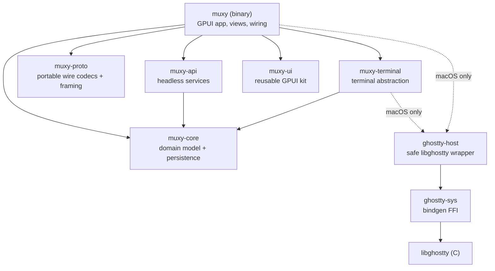
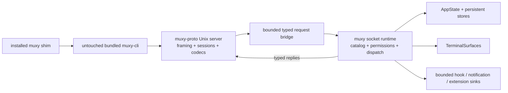
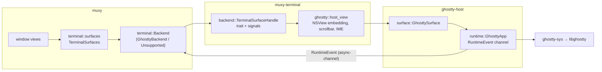
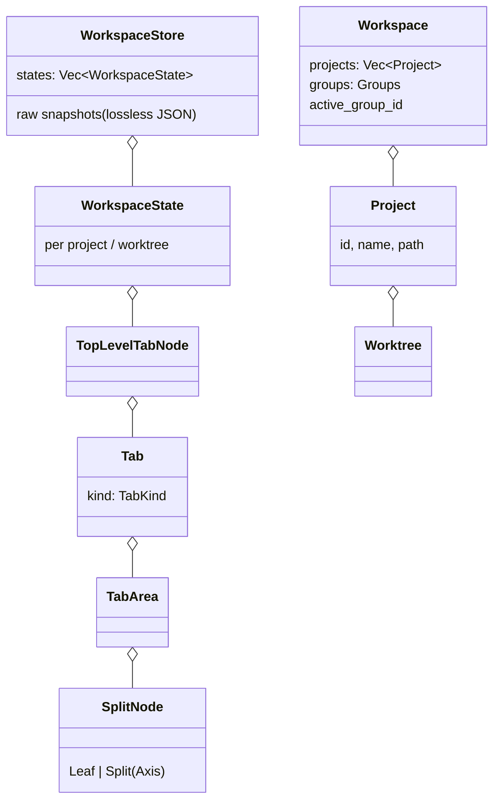
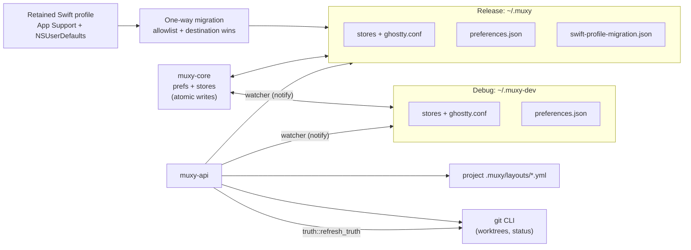
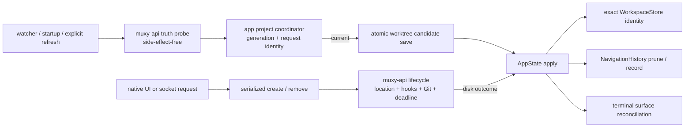
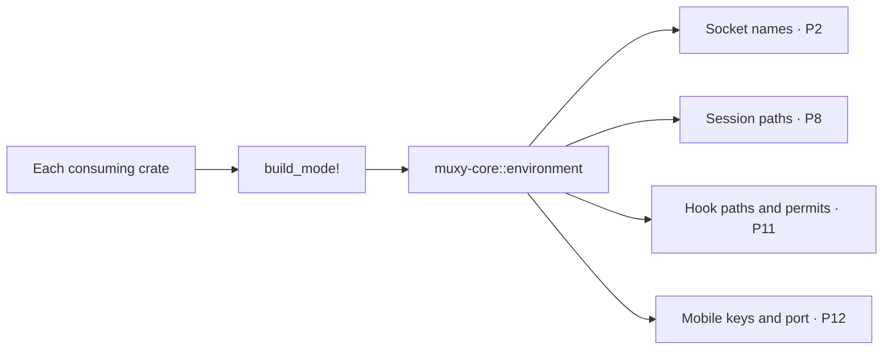
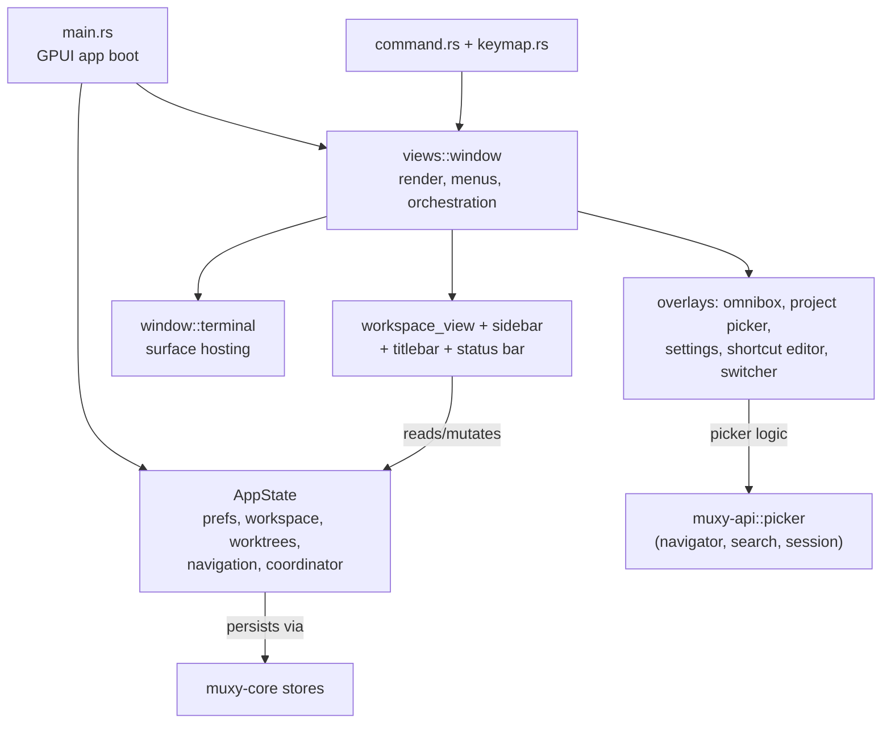
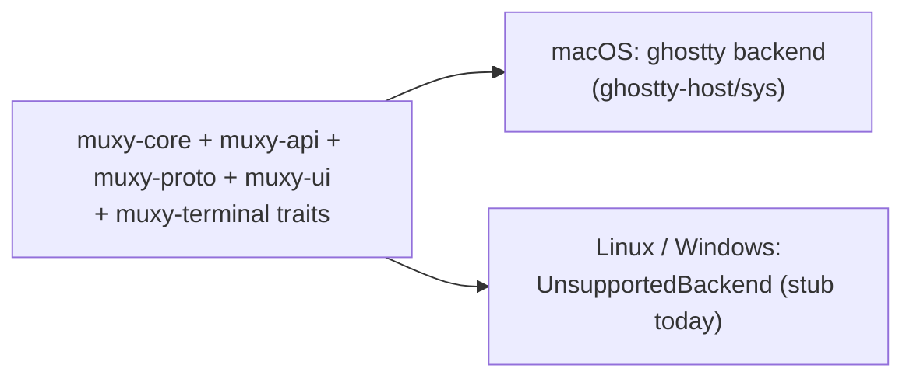

# Architecture

Muxy is a Cargo workspace of 8 crates, layered so that domain logic, protocols, and services are platform-agnostic and testable, while GPUI and macOS-specific code live at the edges.

## Crate graph

`muxy-proto` is a headless downstream dependency for socket callers. It owns portable codecs, framing, session policy, extension correlation, and the Unix listener. The `muxy` binary owns command names, permissions, app state, terminal resolution, and lifecycle wiring. The protocol crate never depends back on `muxy`, GPUI, domain stores, terminal crates, Ghostty, or Objective-C libraries.

## Responsibilities

| Crate | What lives there | Depends on GPUI? | macOS-only code? |
|---|---|---|---|
| `muxy` | app entry, `AppState`, all views, commands, keymap, terminal glue | yes | terminal backend |
| `muxy-api` | git, worktree lifecycle/hooks/locations, bounded subprocesses, project "truth", IDE detection, layouts, yaml, fs watcher, picker logic | no | Unix process-group edge only |
| `muxy-proto` | portable wire types, strict codecs, framing, and transport policy | no | Unix transport edge only |
| `muxy-core` | prefs, settings catalog, shortcuts, navigation history, stores, workspace/tab tree model | no | migration-only user-defaults access |
| `muxy-terminal` | backend trait, surface signals, search, scrollbar, confirmation | no | ghostty impl |
| `muxy-ui` | theme, icons, components, controls, text input, scrollbar | yes | SF Symbols |
| `ghostty-host` | runtime, surface, config, input, mouse — safe API over FFI | no | yes |
| `ghostty-sys` | raw bindgen bindings | no | yes |

## Socket stack

The socket runtime is owned by the app lifecycle and shuts down with the window/app. Debug and release socket names come from `muxy-core::environment`; the protocol crate receives an explicit path and contains no filename policy. The complete framing, routing, command ownership, and exclusion contract is documented in [Socket protocol](docs/development/socket-protocol.md).

## Terminal stack

Events flow back asynchronously: libghostty callbacks → `ghostty-host` `RuntimeEvent` channel → `muxy::terminal::TerminalEvents` → GPUI views.

## Workspace / tab model (muxy-core)

## Persistence & external state

- Release reads the Swift profile only while its versioned migration state is pending. Completed, source-missing, and abandoned outcomes do not inspect it again.
- Normal preference reads and writes use private atomic `preferences.json`. `NSUserDefaults` is migration-only.
- File writes go through `store::persistence`; migration copies use unique destination-side temporary files and no-replace publication.
- `muxy-api::truth` recomputes per-project git facts off the UI thread; `watcher` retriggers on file changes.

## Worktree truth, lifecycle, and navigation

Truth probing never writes. `ProjectOperations` serializes explicit refresh, create, and remove per project, rejects
duplicates deterministically, and invalidates older generation/request identities before a candidate may be saved or
applied. Views render state and initiate requests; they do not own Git, hook, path, deadline, persistence, or navigation
policy.

`muxy-api` owns the disk-first lifecycle. Creation validates and resolves its location before Git, then never rolls back
a created checkout for later persistence or setup failures. Removal runs approved teardown and Git before exact
application cleanup. `AppState` removes workspace/raw-snapshot identity by project and worktree IDs, collects pane IDs
before deletion, prunes navigation, selects a surviving worktree in deterministic order, and retains that in-memory
result when post-disk persistence reports warnings.

`muxy-core::navigation` owns the 100-entry history, duplicate/forward truncation, live-target search, explicit cursor
commit, and pruning. App selection uses one navigation-aware workspace persistence seam; failed persistence restores the
previous selection and does not commit the cursor.

## Development and production policy

`muxy-core::environment` owns build-mode names and authorization facts.

Each binary invokes `build_mode!` locally. No runtime environment variable selects development mode.

| State | Debug | Release | Staged test |
|---|---|---|---|
| Bundle identity | `com.muxy.dev` | `com.muxy.app` | `com.muxy.tests` |
| Root | `~/.muxy-dev` | `~/.muxy` | Injected ignored root |
| Preferences | Root-local `preferences.json` | Root-local `preferences.json` | Root-local `preferences.json` |
| Ghostty configuration | Root-local | Root-local | Root-local |
| Swift import | Never | One bounded migration | Injected synthetic source only |
| Runtime names | Development policy | Production policy | Selected build policy |

Debug and release select their roots by compile-time build mode. Environment overrides are honored only by recognized test executables. Mobile runtime implementation remains assigned to P12.

## App wiring (muxy binary)

Views own no business logic: pickers, search, Git truth, worktree lifecycle, bounded processes, and layout parsing are called out to `muxy-api`; navigation and tab-tree mutations go through `muxy-core`; rendering primitives come from `muxy-ui`.

## Platform strategy

Everything above the `muxy-terminal::backend` trait is platform-neutral. Worktree, navigation, lifecycle, hook, Git, persistence, and coordinator policy is shared Rust. Unix subprocess cleanup uses a process group on macOS and Linux; other targets use a direct-child fallback until they gain an equivalent descendant-kill edge. Path reveal, native file dialogs, the current Unix socket host, and terminal embedding remain platform edges. Porting means implementing a backend and those small `cfg(target_os)` islands without moving policy into them.
