# Architecture

Muxy is a Cargo workspace of 8 crates, layered so that domain logic, protocols, and services are platform-agnostic and testable, while GPUI and macOS-specific code live at the edges.

## Crate graph

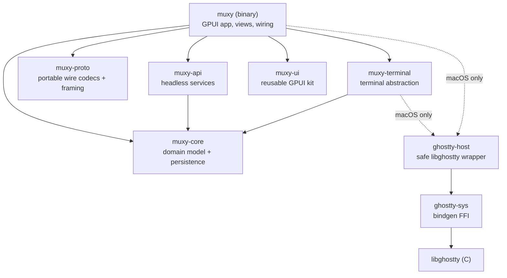

`muxy-proto` is a headless downstream dependency for socket callers. It owns portable codecs, framing, session policy, extension correlation, and the Unix listener. The `muxy` binary owns command names, permissions, app state, terminal resolution, and lifecycle wiring. The protocol crate never depends back on `muxy`, GPUI, domain stores, terminal crates, Ghostty, or Objective-C libraries.

## Responsibilities

| Crate | What lives there | Depends on GPUI? | macOS-only code? |
|---|---|---|---|
| `muxy` | app entry, `AppState`, all views, commands, keymap, terminal glue, notification coordination and platform delivery | yes | terminal backend, UserNotifications, NSSound |
| `muxy-api` | git, worktree lifecycle/hooks/locations, bounded subprocesses, project "truth", IDE detection, layouts, yaml, fs watcher, picker logic | no | Unix process-group edge only |
| `muxy-proto` | portable wire types, strict codecs, framing, and transport policy | no | Unix transport edge only |
| `muxy-core` | prefs, settings catalog, shortcuts, navigation history, notification model/store/coalescing, stores, workspace/tab tree model | no | migration-only user-defaults access |
| `muxy-terminal` | backend trait, surface signals, search, scrollbar, confirmation | no | ghostty impl |
| `muxy-ui` | theme, icons, components, controls, text input, scrollbar | yes | SF Symbols |
| `ghostty-host` | runtime, surface, config, input, mouse — safe API over FFI | no | yes |
| `ghostty-sys` | raw bindgen bindings | no | yes |

## Socket stack

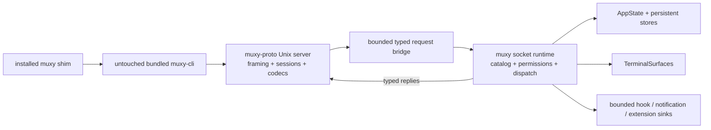

The socket runtime is owned by the app lifecycle and shuts down with the window/app. Debug and release socket names come from `muxy-core::environment`; the protocol crate receives an explicit path and contains no filename policy. The complete framing, routing, command ownership, and exclusion contract is documented in [Socket protocol](docs/development/socket-protocol.md).

## Terminal stack

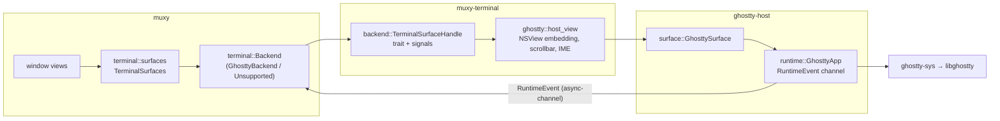

Events flow back asynchronously: libghostty callbacks → `ghostty-host` `RuntimeEvent` channel → `muxy::terminal::TerminalEvents` → GPUI views.

## Quick Terminal stack

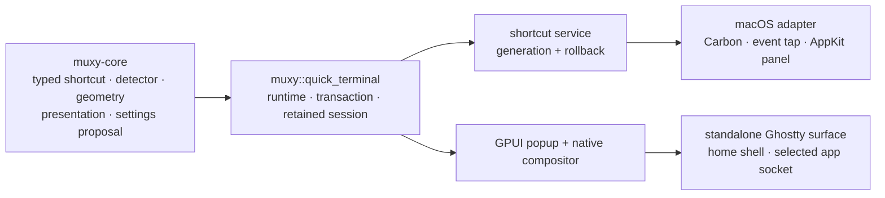

`muxy-core` owns the portable shortcut schema, double-Shift detector, conflict inputs, geometry, presentation generations, and settings proposal validation. It has no GPUI, AppKit, Carbon, CoreGraphics, window, route, or workspace dependency. The `muxy` binary owns the application-scoped runtime, native registration transaction, settings coordination, panel, and standalone terminal lifecycle. macOS APIs are contained in the target-gated Quick Terminal platform adapter; other targets compile a same-shaped unsupported adapter.

The shortcut service starts a replacement registration before publishing it, generation-guards callbacks, and stops the previous backend only after persistence succeeds. Double Shift always has a local monitor on macOS. An authorized listen-only event tap upgrades it to system-wide monitoring; denial or revocation leaves local monitoring available. Conventional key combinations use Carbon and do not require Input Monitoring.

The Quick Terminal shell is not a workspace terminal or a background session. It starts in the user's home directory, receives only the selected app socket from Muxy's identity environment, and creates no project, worktree, pane, tab, hook, or daemon-session identity. One surface is retained while the panel is hidden, recreated after process exit, and terminated on disable or app shutdown.

The panel and terminal surface are prepared at their final constrained dimensions while hidden before every opening. Show and hide animate one Core Animation clipping mask around both GPUI chrome and the native terminal, so presentation does not resize the terminal viewport. The gear hides the panel and opens the main app's Quick Terminal settings category. Size, transparency, and blur writes are persisted without mutating the visible panel, then loaded during the next hidden preparation. Transparency is a continuous tint-alpha setting. GPUI exposes only opaque, transparent, and blurred window backgrounds, so a stored blur of zero selects transparent mode and any nonzero blur selects the same window-level blurred mode. Reduce Transparency or Increase Contrast forces an opaque effective appearance without rewriting stored values.

Quick Terminal settings and schema remain portable, but the category and route are omitted on Linux because there is no runtime backend. Linux-host launch proof remains separate release work.

## Composer stack

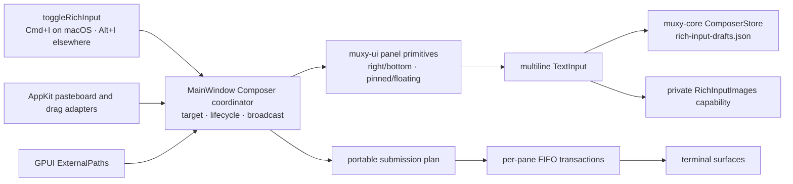

Composer is panel-only inside the main window. `muxy-ui::panel` owns reusable placement, resize, chrome, and pinned-versus-overlay geometry without Composer policy. The app owns target reconciliation, broadcast selection, file/image preparation, feedback, pasteboard timing, and per-pane publication. `muxy-core::composer` owns portable drafts, image validation/storage, reference sweeping, and submission planning without GPUI, AppKit, terminal, or app dependencies.

Drafts are keyed by project/worktree identity and atomically published to the selected profile's private `rich-input-drafts.json`. Copied clipboard images live in the private `RichInputImages/` directory behind descriptor-relative no-follow operations. Startup sweeping removes only proven unreferenced files. Successful submission clears only the unchanged submitted revision when enabled; failures and newer edits retain their references.

Terminal submission is one FIFO transaction per pane. Text and escaped attachment segments are bracketed-paste framed, optional Return is appended only by transaction policy, native key events defer while a transaction owns the pane, and broadcast panes are processed sequentially. Clipboard image strategy temporarily owns the app-wide pasteboard and restores every captured representation; inline-path strategy emits escaped local paths.

External drops share `muxy-core::dropped_paths` parsing. Composer attaches accepted paths as files, the sidebar accepts only existing directories, and the macOS Ghostty host emits a neutral payload that the app routes with surface identity before focusing and inserting escaped paths without Return. Unsupported terminal backends expose no external-drop event stream.

## Notification stack

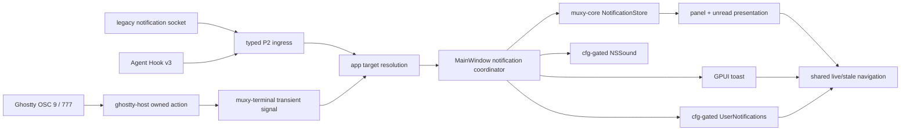

`muxy-core` owns the portable record shape, tolerant capped store, unread queries, atomic persistence, and two-second desktop-only hook/OSC pairing. It has no GPUI or platform dependency. `ghostty-host` copies Ghostty callback data into an owned action, and `muxy-terminal` exposes only a backend-neutral transient signal. Target resolution finishes in the app before the coordinator mutates the store or invokes a presentation or platform edge.

`MainWindow` owns notification coordination, the latest-replacing three-second toast, the two-second save debounce, native response pumping, and both final flush paths. `AppState` owns `NotificationStore`. The store writes a private top-level array to the selected profile's `notifications.json`, retains at most 200 newest records, and marks loaded history read at startup without importing the retained Swift file. Closing the main window and quitting the app both synchronously flush dirty history.

macOS desktop delivery and sound playback are narrow services under `muxy::notifications`; unsupported platforms expose unavailable or no-op behavior. Ordinary desktop delivery never prompts for permission. Enabling the desktop setting owns the authorization request. Views render records and emit remove, clear, navigation, and settings intents; they do not persist history, schedule native requests, play sounds, or decide ingress policy.

## Workspace / tab model (muxy-core)

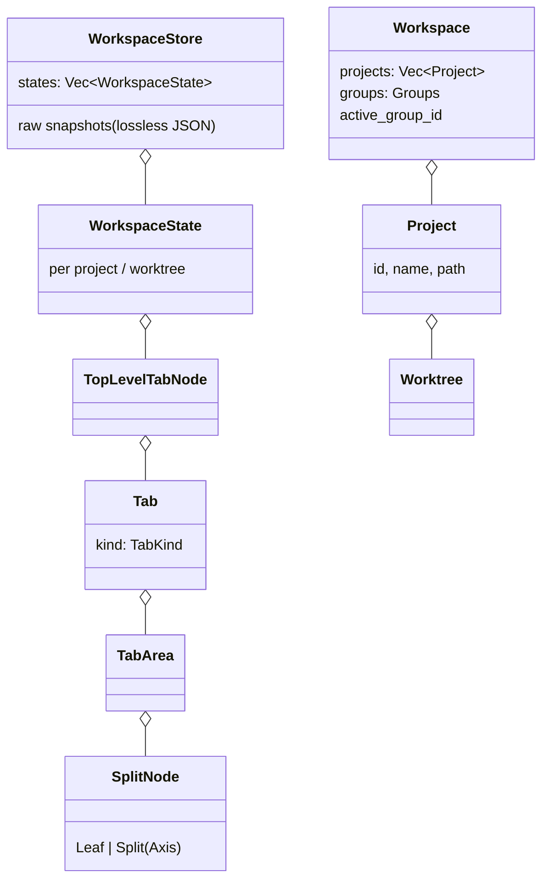

## Persistence & external state

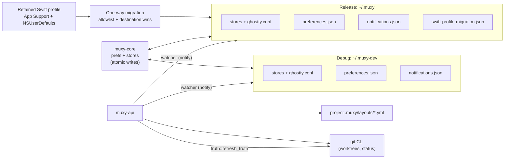

- Release reads the Swift profile only while its versioned migration state is pending. Completed, source-missing, and abandoned outcomes do not inspect it again.
- Normal preference reads and writes use private atomic `preferences.json`. `NSUserDefaults` is migration-only.
- File writes go through `store::persistence`; migration copies use unique destination-side temporary files and no-replace publication.
- `muxy-api::truth` recomputes per-project git facts off the UI thread; `watcher` retriggers on file changes.

## Worktree truth, lifecycle, and navigation

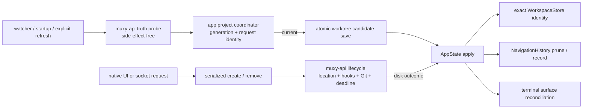

Truth probing never writes. `ProjectOperations` serializes explicit refresh, create, and remove per project, rejects
duplicates deterministically, and invalidates older generation/request identities before a candidate may be saved or
applied. Views render state and initiate requests; they do not own Git, hook, path, deadline, persistence, or navigation
policy.

`muxy-api` owns the disk-first lifecycle. Creation validates and resolves its location before Git, then never rolls back
a created checkout for later persistence or setup failures. Removal runs approved teardown and Git before exact
application cleanup. `AppState` removes workspace/raw-snapshot identity by project and worktree IDs, collects pane IDs
before deletion, prunes navigation, selects a surviving worktree in deterministic order, and retains that in-memory
result when post-disk persistence reports warnings.

`muxy-core::navigation` owns the 100-entry history, duplicate/forward truncation, live-target search, explicit cursor
commit, and pruning. App selection uses one navigation-aware workspace persistence seam; failed persistence restores the
previous selection and does not commit the cursor.

## Repository and AI execution

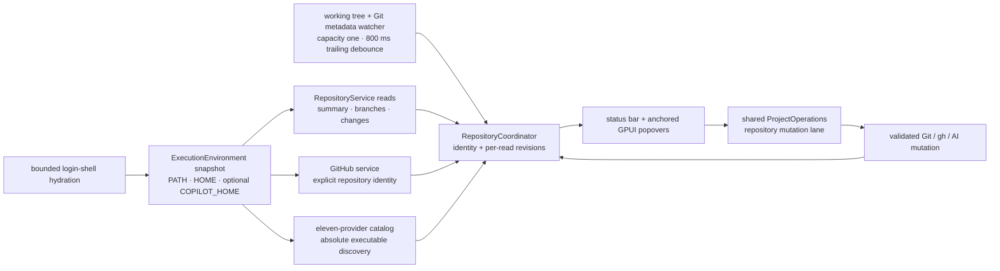

The selected local project and exact worktree define repository identity. Terminal CWD, a previous project, remote
placeholders, and non-Git directories cannot redirect a read or mutation. Summary, branch, changes, pull-request, and
provider reads carry independent monotonically increasing revisions and cancellation signals. The coordinator rejects
late results after identity, branch, HEAD, environment, or request changes. It preserves verified summary and
pull-request presentation during replacement reads so ordinary refreshes do not flash status controls back to generic
loading labels.

`muxy-api::repository` owns bounded Git and `gh` processes, raw-path validation, repository parsers, safe mutations,
GitHub identity, and AI workflows. Every child receives a sanitized environment and direct argv, bounded independent
streams, a retained deadline, cancellation, and process-group cleanup on Unix. Repository reads may disable optional
locks; mutations revalidate captured branch, HEAD, remote, upstream, push ref, and GitHub identity immediately before
their irreversible boundary. Raw changed-file identities remain byte-preserving and destructive untracked deletion is
descriptor-relative and symlink-safe.

`RepositoryCoordinator` and `ProjectOperations` form one mutation lane shared by worktree, branch, changes,
pull-request, and AI actions. Reads coalesce while the current identity owns that lane. An identity change cancels work
that has not dispatched; an already-dispatched irreversible child may finish only as a bounded stale operation and
cannot block or consume the new identity's refreshes. Completion releases both lanes exactly once and refreshes only
the truth affected by the outcome. Closing the app cancels and reaps every child and rejects all late UI output.

The provider catalog and prompt policy live once in `muxy-core`. Provider discovery resolves exact executable files
from the hydrated snapshot; execution uses fixed headless arguments, a replacement environment, closed stdin, 256 KiB
per output stream, and a five-minute workflow deadline. Prompt construction bounds configured and one-run prompts,
repository fields, lists, diffs, new-file content, and total payload; it never logs prompts or responses. Commit and
create-PR workflows revalidate branch, HEAD, staged tree, remote, upstream, push target, and GitHub identity at every
relevant boundary and report exact partial effects without attempting unsafe rollback.

All repository, GitHub, provider, and AI policy is headless and Linux-checkable in `muxy-api` and `muxy-core`. GPUI
status controls and reusable virtualized popovers stay in `muxy` and `muxy-ui`. Unix process-group handling, native URL
launching, filesystem descriptor APIs, and watcher backends are narrow cfg-gated edges behind neutral services. Whole
app Linux linking and launch remain P15 work; P4 proves the headless Linux target separately.

## Development and production policy

`muxy-core::environment` owns build-mode names and authorization facts.

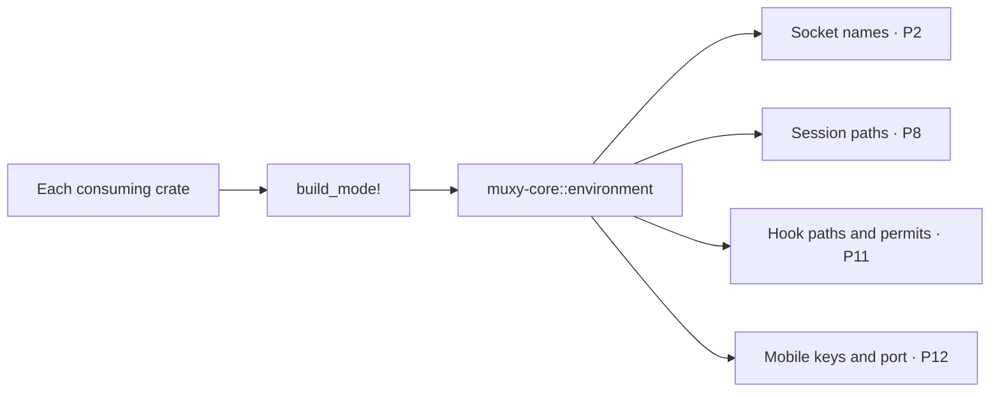

Each binary invokes `build_mode!` locally. No runtime environment variable selects development mode.

| State | Debug | Release | Staged test |
|---|---|---|---|
| Bundle identity | `com.muxy.dev` | `com.muxy.app` | `com.muxy.tests` |
| Root | `~/.muxy-dev` | `~/.muxy` | Injected ignored root |
| Preferences | Root-local `preferences.json` | Root-local `preferences.json` | Root-local `preferences.json` |
| Ghostty configuration | Root-local | Root-local | Root-local |
| Swift import | Never | One bounded migration | Injected synthetic source only |
| Runtime names | Development policy | Production policy | Selected build policy |

Debug and release select their roots by compile-time build mode. Environment overrides are honored only by recognized test executables. Mobile runtime implementation remains assigned to P12.

## App wiring (muxy binary)

Views own no business logic: pickers, search, Git truth, worktree lifecycle, bounded processes, and layout parsing are called out to `muxy-api`; navigation and tab-tree mutations go through `muxy-core`; rendering primitives come from `muxy-ui`.

## Platform strategy

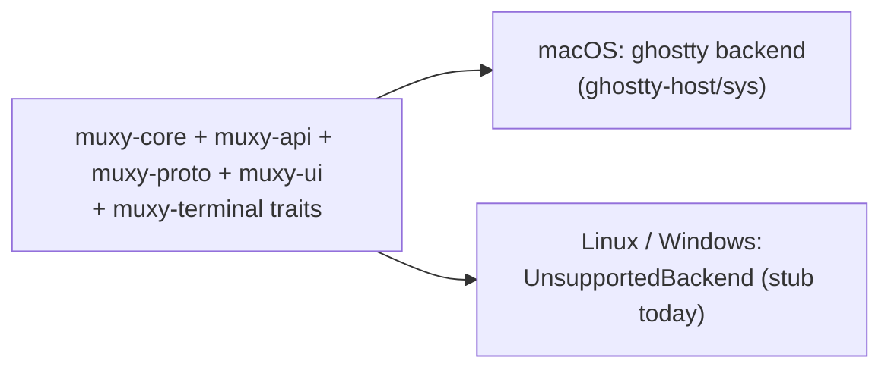

Everything above the `muxy-terminal::backend` trait is platform-neutral. Worktree, navigation, lifecycle, hook, Git, persistence, and coordinator policy is shared Rust. Unix subprocess cleanup uses a process group on macOS and Linux; other targets use a direct-child fallback until they gain an equivalent descendant-kill edge. Path reveal, native file dialogs, the current Unix socket host, and terminal embedding remain platform edges. Porting means implementing a backend and those small `cfg(target_os)` islands without moving policy into them.
