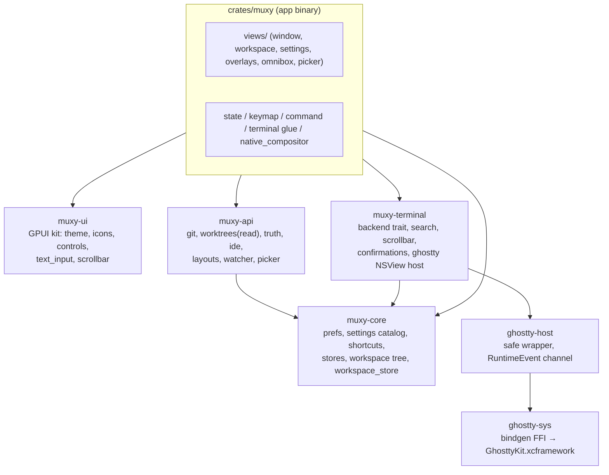
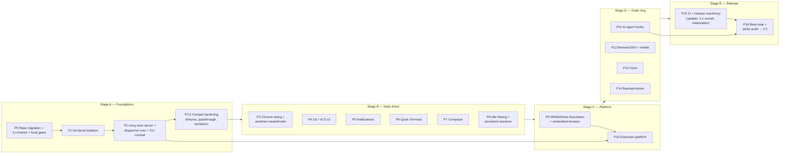
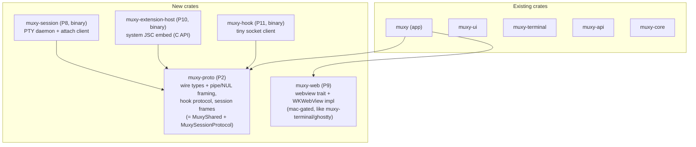

# Muxy 2.x — Full-Picture Migration Plan (Swift → Rust/GPUI)

## Context

Muxy 1.x is a Swift/SwiftUI macOS app — far more than a terminal: terminal emulator (libghostty) + project/worktree manager + JS extension platform + embedded browser + mobile WebSocket server + AI-agent hook system + tmux-like persistent sessions. The Rust + GPUI rewrite is now in this repository on the `2.x` branch, with the 7-crate workspace at the branch root and the Swift implementation retained alongside it as the parity reference. The architecture refactor is **fully complete** and mechanically enforced by `scripts/check.sh`. The old phase plans are consumed or superseded; this document is the single roadmap for finishing the rewrite. It has passed one adversarial review pass; corrections from that review are folded in.

**Goal:** Muxy 2.0 for macOS — a drop-in replacement for the Swift app. Users download 2.x, replace the app, and everything just works: same config files, same storage, same sockets, same CLI, zero migration. Linux comes after (this roadmap only keeps it compiling and launching).

## Decisions of Record (from interview)

| # | Decision |
|---|---|
| 1 | **Full parity** — 2.0 ships every Swift subsystem: extensions, browser, mobile server, AI hooks, persistent sessions, quick terminal, composer, voice, backup, CLI. |
| 2 | **Dev/prod isolation** mirrored from Swift — added early, essential for development. |
| 3 | **Webview:** direct WKWebView via objc2, hosted through the existing `native_compositor`. |
| 4 | **Extension host:** out-of-process Rust binary using **system JavaScriptCore** — exact engine parity with 1.x extensions. |
| 5 | **Persistent sessions + idle offline freeing:** both rebuilt (both default **off** in 1.x — verified). Rust daemon uses the same paths and framed protocol. |
| 6 | **Updates:** Sparkle is NOT carried over. 2.x ships a unified Rust-native updater (Mac now, Linux later). Bundle id stays `com.muxy.app`; existing users upgrade by manual download-and-replace. |
| 7 | **CLI:** keep the bash wrapper untouched — "the installed CLI just works" is an acceptance test of the socket server's fidelity. |
| 8 | **Sentry: dropped entirely.** Local diagnostics (logs, profiler, Diagnostics menu, export) stay. |
| 9 | **Transparency/vibrancy:** window-level transparency+blur via GPUI honoring the existing settings; per-region NSVisualEffectView vibrancy is not reproduced. |
| 10 | **Linux (this roadmap):** app must compile, open, and show working chrome with the terminal pane as placeholder. Nothing more. |
| 11 | **Parity first, polish opportunistic** — no dedicated redesign phases. |
| 12 | **Dogfood-first ordering** — enablers → daily-driver parity → platform → outer ring → release machinery. |
| 13 | **Repo workflow:** the active rewrite repository is `~/Projects/muxy-2.x` on branch `2.x`. The Rust workspace lives at the branch root alongside the retained Swift parity reference. Feature branches PR into `2.x`; `~/Projects/muxy` remains the 1.x working copy. |
| 14 | **Release gate:** beta-channel soak + full parity checklist (details in Verification). |

## Open decisions (surfaced by adversarial review — resolve at owning phase's planning)

| Phase | Decision |
|---|---|
| P2.5 | Fidelity level of `settings.json` ↔ defaults sync: genuinely live (file watcher + defaults observation like 1.x) or documented startup/write-time sync. 1.x is live; anything less must be proven safe under coexistence. |
| P10 | Fate of the **in-process** command-script runner (`ExtensionScriptRunner`, a second JSC embed inside the app with synchronous `__muxyDispatch`): keep in-process (breaks "JSC only in host" rule, adds JIT entitlement to main binary) vs move to the host process (changes command-script semantics). |
| P14 | 1.x latent bug: `config-export` is missing from `verbNames` so `muxy config export` gets no reply in 1.x. Reproduce or fix. |
| P15 | 1.x sunset specifics: contents of the final 1.x release / frozen appcast, beta-channel (rolling `beta-channel` tag) cutover, and whether the Homebrew tap continues. |

## Current State — Already Done

**P0 repo migration is complete:** the active rewrite now lives on the `2.x` branch in `~/Projects/muxy-2.x`; the Rust workspace is at the repository root, the Swift implementation remains available in the same branch for parity work, and local quality gates remain in `scripts/check.sh`. CI is intentionally deferred to P15 before release.

The refactored workspace (all enforced by `scripts/check.sh` — comment ban, crate-boundary gates, fmt/clippy/tests/bundle):

**Working today** (~43.6k LOC, 303 unit tests):
- Terminal stack: libghostty FFI → host → NSView (IME, CJK fonts, mouse, pressure) → GPUI compositing; shell launch with startup commands; OSC titles/PWD/progress; search; overlay scrollbar; clipboard/paste/close confirmations.
- Tabs/splits: full two-level tree (top-level tab groups + per-group split trees), drag/dock/reorder, pin/color/icon/rename, maximize, directional focus.
- Persistence **aimed at** 1.x compatibility, with known hardening debt (see P2.5): `workspaces.json` has lossless raw passthrough; `projects.json` round-trip test exists but silently skips without a real profile; `projects.json`/`worktrees/*.json` currently **drop unknown Swift fields on write**; three different serializers are in use (hand-rolled Foundation writer, `to_vec_pretty`, compact `to_vec`) so byte-shape is not yet uniform; the 68-key settings MIRROR syncs at startup/own-writes only (not live), 5 composite keys + 3 `editor.*` keys are write-broken via the JSON editor; startup reads bypass cfprefsd via direct plist read; some prefs tests mutate the live `com.muxy.app` domain.
- Projects/groups/worktrees (read + switch), git truth off-thread, FS watcher, project picker, omnibox (6 scopes), repo layouts (`.muxy/layouts/*`), 490 bundled themes + paired light/dark, keybindings (54 of 1.x's 68 bindable actions modelled + unmodelled passthrough — parity audit needed), chorded command shortcuts + editor UI, settings modal (16 categories + JSON editor), native menu bar, app bundling/signing scripts (ad-hoc, single-binary only).

## Gap Map — 1.x feature vs 2.x status

| Subsystem | Status in Rust |
|---|---|
| Terminal emulation, search, scrollbar, confirmations | ✅ done (CJK temp-conf machinery needs parity audit) |
| Tabs/splits/workspace persistence | ✅ done |
| Projects/groups/picker/omnibox/layouts/themes/keybindings/settings UI | ✅ done (some inert buttons; compat hardening pending) |
| Compat hardening (fixtures, raw passthrough, uniform serializer, live sync) | ❌ P2.5 |
| Worktree **create/remove**, path templates, setup/teardown hooks | ❌ missing (read/switch only) |
| Titlebar buttons, welcome New Tab, sort, nav arrows, misc inert settings actions | ❌ inert |
| Git UI (changes/branch/PR popovers, commit/push/pull, gh, AI commit/PR text) | ❌ missing |
| Notifications (toast/panel/desktop/sounds/navigation, OSC 9/777) | ❌ missing |
| Quick Terminal (global hotkey, panel) | ❌ settings only |
| Composer / rich input (+ drafts, attachments, broadcast) | ❌ settings only |
| Idle terminal offline freeing + process-tree resource monitor | ❌ settings only |
| Persistent sessions (`muxy-session` daemon + attach + UI) | ❌ missing |
| `muxy.sock` server + verb dispatcher (3 entry surfaces) + CLI | ❌ missing |
| Extension platform (host, manifests, permissions, consent, audit, marketplace, surfaces) | ❌ missing |
| Embedded browser (WKWebView, profiles, history, automation, cookie import) | ❌ missing |
| AI agent hooks (muxy-hook, installer for 11 providers, agent detection, agents layout) | ❌ missing |
| Remote/SSH workspaces + remote devices (incl. legacy SSH-workspace migration) | ❌ read-only store files |
| Mobile server (WebSocket, Bonjour, pairing, 53 RPCs) | ❌ settings only |
| Voice / dictation | ❌ missing |
| Backup/restore (`.muxy` archive) | ❌ inert buttons |
| Updater + 1.x sunset, What's New, tips, Diagnostics menu, URL scheme, doc type | ❌ missing |
| Localization (extension-provided languages, catalog) | ❌ missing |
| Drag-and-drop of files/paths (terminal, sidebar, composer) | ❌ missing |
| Quit confirmation, terminateLater cleanup, relaunch-in-place | ❌ missing |
| Login-shell PATH hydration (provider/CLI discovery depends on it) | ❌ missing |
| install-skills + bundled skills + starter kits | ❌ missing |
| Deferred startup ordering, TCC usage strings, tooltip/press-and-hold defaults | ❌ missing |
| Transparency/blur, app layouts (`tabFocused`/`agentsFocused` refinements) | ❌ partial (projectFocused chrome only) |
| Dev/prod isolation (incl. `FF_AI_HOOKS` gate) | ❌ missing |
| Release signing/notarization/DMG, multi-binary bundle | ❌ ad-hoc, single binary |

Note: 1.x has **no** menu-bar extra/NSStatusItem and **no** onboarding flow — none should be assumed.

## Roadmap

Each phase gets its own detailed plan (grill-me per task) before implementation. Scopes below define boundaries and acceptance, not implementation detail.

### Stage A — Foundations

**P0 — Repo migration, workflow & local quality gates. COMPLETE.**
The active rewrite repository is `~/Projects/muxy-2.x` on branch `2.x`. The 7-crate Rust workspace is at the repository root alongside the retained Swift implementation, which remains the parity reference while the rewrite proceeds. Feature branches target `2.x`; `~/Projects/muxy` remains the 1.x working copy. Local enforcement is provided by `scripts/check.sh`, `scripts/build-app.sh`, and `scripts/verify-bundle.sh`. New phases extend crate-boundary and bundle gates when they add crates or executables. The existing 1.x workflows remain in the repository, while Rust macOS/Linux CI is deliberately deferred to P15 so it lands before release.
*Acceptance: complete.* The active repository and `2.x` workflow are established, the Rust workspace builds from the branch root, and local quality gates are available.

**P1 — Dev/prod isolation.**
Replicate 1.x `AppEnvironment.isDevelopment` semantics exactly — enumerate all switch sites: `muxy-dev.sock`, `sessions-dev/`, `hooks-dev/`, `/tmp/muxy-dev-<uid>` fallback, mobile port 4866 + dev forcing server on, the three `.dev` defaults keys (incl. `scrollbackCap.dev`), and the hook binary's independent dev-socket-name logic. **Include the `FF_AI_HOOKS` gate**: dev builds must not install/repair provider hooks unless explicitly opted in — this is what makes dogfooding safe. State explicitly (as 1.x does): App Support JSON stores and `UserDefaults.standard` are **shared** between dev and prod by design.
*Acceptance:* dev build and release Swift app coexist without socket/hook/session collisions; dev build never touches provider configs.

**P2 — Socket server + dispatcher core + CLI compat.**
Reproduce the real `NotificationSocketServer` protocol — **newline-delimited pipe-separated text** with base64-nested JSON fields (not NDJSON); CLI command replies are raw text terminated by a NUL byte then close; server→client `invoke` RPC with 15s timeout; modal push channels; 128 KiB message cap; no protocol versioning; subscription allowlist enforced only for identified extensions; in-flight cap (8) and 100-drop disconnect are extension-scoped. **Hook-envelope handling is structural to the server**: every unidentified line gets an `AgentHookProtocol` v3 JSON parse attempt + JSON ack, 256-entry dedup ring, PID→pane resolution — this lands here (P11 adds the installer/binary, not the server semantics). Document the three verb surfaces distinctly: `SocketCommandHandler` pipe verbs (~60), `MuxyAPIDispatcher` (146 dispatched cases; 169 accepted names incl. 37 legacy aliases), and the ~15 verbs implemented outside the dispatcher (`panes.split`, `sessions.*`, `tabs.rename/close/move`, lifecycle). Implement in P2 the verbs backed by existing functionality; later phases own their verbs (36 `browser.*` → P9, `list-sessions`/`kill-session` → P8, `create-worktree` → P3, `config-export|import` → P14). Bundle contract: ship `muxy-cli` at the literal legacy path `Contents/Resources/Muxy_Muxy.bundle/scripts/muxy-cli` (installed shims hardcode it); note the CLI's default socket is the **prod** path (dev relies on `MUXY_SOCKET_PATH` from panes) and `open-project` uses `muxy://open` + `open -b com.muxy.app`. Terminal env contract exported into panes: `MUXY_PANE_ID`, `MUXY_PROJECT_ID`, `MUXY_WORKTREE_ID`, `MUXY_SOCKET_PATH` (`MUXY_HOOK_BIN`/`MUXY_HOOK_SCRIPT` land in P11 — verify the claude wrapper tolerates their absence, else stub the staging dir here).
*Acceptance:* an explicit enumerated list of CLI commands achievable at P2 (status/notify/project/tab/pane read paths) passes against the installed 1.x wrapper via the legacy shim path.

**P2.5 — Compatibility hardening.**
Make the byte-parity contracts true before daily dogfooding writes real data: capture a golden fixture corpus from a real 1.x profile (checked into the repo, tests fail — not skip — without it); add lossless raw passthrough to `projects.json` and `worktrees/*.json` (matching `workspaces.json`/`project-groups.json`); unify on one Foundation-shaped serializer per 1.x's per-file profile (compact / pretty / prettySorted / `withoutEscapingSlashes`), including `workspaces.json` ordering; resolve the settings-sync open decision (live vs startup) and fix the 8 write-broken JSON-editor keys; cfprefsd-safe defaults reads (drop or fence the direct plist read); isolate prefs tests from the live `com.muxy.app` domain (dedicated suite/dir override like 1.x's `MUXY_TEST_APPLICATION_SUPPORT_DIRECTORY`); Foundation-date conversion tests.
*Acceptance:* cross-run harness green — Swift writes → Rust reads → Rust writes → Swift reads, byte-diff clean per file profile; Swift 1.x launches and behaves against a profile 2.x has been writing.

### Stage B — Daily-driver parity

**P3 — Chrome wiring + worktree lifecycle.**
Wire every inert control that has a backing feature: titlebar split/new-tab buttons, nav arrows, layout menu, welcome New Tab, workspace sort, sidebar footer, status-bar buttons (new-browser-tab button wires in P9 when browser exists). Worktree **create/remove** with `{branch}`/`{project-name}`/`{base-dir}` path templates, `worktree-checkouts/` management, `.muxy/worktree.json` + `~/.config/muxy/worktree.json` setup/teardown hooks with the approval/hash-check flow, 5-min budget, and `MUXY_*` env contract. Includes the CLI `create-worktree` verb.
**P4 — Git/VCS UI.** Changes/branch/PR popovers, stage/unstage/discard, commit, push/pull, repo status bar, `gh` integration, AI-generated commit messages and PR text. Login-shell PATH hydration lands here (git/gh/provider discovery depends on it).
**P5 — Notifications.** OSC 9/777 + socket sources (hook source already flows via P2's server; extensions later) into one store: toast (4 positions), panel with read state, macOS UserNotifications when backgrounded, 14 named system sounds + None (via `NSSound(named:)`, nothing bundled), 2-s coalescing, click-to-navigate, `notifications.json` cap 200.
**P6 — Quick Terminal.** Global hotkey (Carbon `RegisterEventHotKey` + double-Shift with Input Monitoring), slide-out panel window, persistent home shell, size/transparency/blur settings, `quick-terminal-shortcut.json` conflict validation.
**P7 — Composer.** `⌘I` panel (dock right/bottom, resizable, pinnable) + floating mode, multiline editor (muxy-ui text_input base), image/file attachments (`RichInputImages/` + orphan sweep), broadcast to panes, per-worktree drafts (`rich-input-drafts.json`), transactional submit, editor-settings fonts. Drag-and-drop of files/paths (composer + terminal + sidebar, `DroppedPathsParser` semantics) lands here.
**P8 — Terminal memory features.**
(a) Idle offline freeing — corrected semantics: there is **no detach API in libghostty**; 1.x does `ghostty_surface_free` + full recreate, scrollback is lost unless the pane is persistent-session-backed, and the startup command is not re-run on wake. Idle detection needs `sysctl(KERN_PROC_TTY)` foreground-pid resolution. Plus the **process-tree** resource monitor (`proc_pid_rusage`) + status-bar CPU/RAM widget.
(b) Persistent sessions — preserve 1.x's architecture: ghostty still runs **in-app**; the surface command is the bundled attach client (`Contents/MacOS/muxy-session attach`), and the daemon is spawned lazily by the attach client via `posix_spawn` (no launchd). Rust `muxy-session` daemon + attach speaking the 1.x framed protocol (`SessionFrame`, 256KB replay, shell-integration injection for 5 shells, LOCAL_PEERCRED, flock singleton, idle self-exit), sessions popover, Send to Background, recovery/reconnect, CLI `list-sessions`/`kill-session`.
Precondition: verify `ghostty-host` exposes the five fork-only APIs P8/P12 rely on (`ghostty_surface_set_data_callback`, `read_cells`, `foreground_pid`, `send_input_raw`, `set_occlusion`).
**Stage B extras:** quit confirmation + `.terminateLater`-style 5s cleanup + relaunch-in-place; deferred-startup ordering ladder; `ApplePressAndHoldEnabled`/tooltip-delay registrations.
*Stage B exit:* you live on the Rust app daily.

### Stage C — The platform

**P9 — WKWebView foundation + embedded browser.**
objc2 WKWebView host through `native_compositor`, behind a webview trait. The hardest part is **reparenting**: one WKWebView surviving moves across splits/tabs with AppKit first-responder handoff (1.x `ReparentingNSViewBroker`) — the vertical spike must cover reparenting + focus, not just embedding. Per-profile data stores with the exact 1.x mapping: the `…-00B0` sentinel maps to `WKWebsiteDataStore.default()`, **not** `forIdentifier:` (getting this wrong loses every user's default-profile cookies). Browser tabs/panes, address bar + suggestions + search engines, history + favicons, find bar, start page, zoom, error page, inspector (note: 1.x uses private SPI — decide fidelity), Chrome cookie import (v10/v11 only; v20 App-Bound Encryption silently fails in 1.x — document, don't "fix" silently), and the 36 `browser.*` verbs across their two wire shapes. Parity includes reproducing 1.x's absences (no JS dialogs, file upload, downloads, HTTP auth).
**P10 — Extension platform.**
Host: 1.x uses the Obj-C **`JSContext`** API; the Rust host on the JSC **C API** is a from-scratch bridge (class definitions, value protection/GC rooting, bidirectional JSON marshalling, exception handling) — cost it as such, and spike it first. Same signing identity, host-specific entitlements plist (JIT trio). Resolve the open decision on the **in-process** `ExtensionScriptRunner` (second JSC embed, dedicated CFRunLoop threads, synchronous `__muxyDispatch`). Manifest = `package.json` with a `muxy` key in `~/.config/muxy/extensions/<name>/` (`dist/` root when present; no `name@version` directory scheme — that's marketplace-side). All contribution points; 25 permissions; 21 events; runtime consent = 11 gated verbs × choices × matchers with 60s timeout (orthogonal to permissions), persisted grants, **rolling** audit log (1 MiB cap → 256 KiB trim); crash-restart policy (5 attempts/30s); extension update flow; dev-path live reload; localization catalog (extension-provided languages); per-extension KV storage (1MiB/value, 5MiB/store); `window.muxy` bridge injection; marketplace + install-by-URL + Load Unpacked + starter kits; rolling logs + debug console (`⌘\``); extension settings routes + shortcut registration. Note the host socket client is single-outstanding-request/no-IDs, and background scripts reach ~40 verbs + `git.*`/`browser.*` — not the full dispatcher.

### Stage D — Outer ring

**P11 — AI agent hooks.** `muxy-hook` Rust binary (protocol v3 client side, 1MiB stdin cap, 400ms budget), staging into App Support `hooks/` (+ shims and provider plugin files), declarative installer/verifier/repairer for all 11 providers (exact JSON shapes into foreign configs, self-write hashing, FSEvents watch, rate limiting, obsolete cleanup incl. OpenCode legacy-plugin removal), foreground-process detection fallback (4s/30s grace), agents-focused sidebar layout, provider Test/Refresh, `MUXY_HOOK_BIN`/`MUXY_HOOK_SCRIPT` env vars. Server-side envelope handling already exists from P2.
**P12 — Remote/SSH + mobile.** Remote devices store (write side) + the **legacy SSH-workspace migration** (`project-groups.json` inline SSH → `remote-devices.json` — data-moving, must exist before any user's first 2.x launch), SSH workspaces/projects/worktrees, remote file browsing, attachment uploads over control sockets; WebSocket server (port 4865/4866), Bonjour `_muxy._tcp`, QR pairing (`muxy://pair`), SHA-256 token approvals, per-pane takeover, scrollback replay caps, 53 RPC methods.
**P13 — Voice.** SFSpeechRecognizer dictation in composer + legacy status-bar recorder (insert into focused control, auto-Return), AVCaptureSession metering, language catalog. Includes the permanently-retained legacy voice shortcut action.
**P14 — Backup/restore.** `.muxy` zip (ditto, manifest schemaVersion 1, exact file/dir set), export sanitization (SSH env vars, approved devices), pre-import snapshot + rollback, CLI `muxy config export|import` (resolve the 1.x `config-export` reply bug decision), settings Backup buttons, `install-skills` + bundled SKILL.md files.

### Stage E — Release

**P15 — CI, release machinery + 1.x sunset.**
Before any 2.x release, stand up Rust CI on macOS and Linux. The macOS runner executes `scripts/check.sh`; the Linux guardrail runs per-package `cargo check --target x86_64-unknown-linux-gnu` for the headless crates and app while **excluding `ghostty-sys`/`ghostty-host`** because `ghostty-sys` build.rs panics off macOS, then performs a launch check. Burn down known Linux-launch gaps such as blank SF Symbols in `muxy-ui` and `/usr/bin/open` shell-outs. Scope the retained 1.x workflows so beta/release triggers and `BETA_VERSION` automation cannot affect `2.x`. CI must be green on both platforms before release work can pass its gate.

Unified Rust updater (feed on GitHub Releases, stable+beta channels honoring `muxy.update.channel` + `SUAutomaticallyUpdate`/`SUEnableAutomaticChecks` keys, signature verification, atomic install/relaunch, Gatekeeper/translocation-safe). **1.x sunset design (critical):** 1.x auto-updates silently from `releases/latest/download/appcast-{arch}.xml` and a rolling `beta-channel` tag — publishing 2.0 releases naively either silently auto-installs 2.0 onto all 1.x users (contradicting decision 6) or 404s their update checks forever. Ship a final 1.x release with a frozen appcast/announcement path, cut the beta channel over deliberately, and decide the Homebrew tap. Developer ID signing + hardened runtime + per-binary entitlements (JIT trio for JSC host; audio/network/apple-events; the 13 terminal-child TCC usage strings) + notarized DMG, **multi-binary bundle** (`muxy-session`, `muxy-hook`, extension host in `Contents/MacOS`, each signed/stripped) + full resource inventory (terminfo, shell-integration ×5 shells, ghostty-overrides, ProviderIcons, skills, starter-kits, muxy-cli at the legacy bundle path); remove `SentryDSN` injection from release scripts (`muxy.sentry.consent` remains a preserved-unknown key, no consent prompt); `muxy://` URL scheme + `.muxy` doc type + `LSMultipleInstancesProhibited` + launch-arg guard (first positional `/`/`~` arg opens a project); What's New modal; tips card; Diagnostics menu + logs — no Sentry; CLI install/migration flow; **all ≥13 documented 1.x migrations** reproduced: ghostty seed (✅ done), paired-theme, composer-voice keybinding, quick-terminal blur, `terminal-sessions.json` cleanup, extension `enabled` migration, CLI wrapper version, decode-with-defaults everywhere, legacy SSH workspaces (P12), `command-shortcuts.json` bare-array shape, `legacyExtraTabs` layouts, OpenCode legacy plugin removal (P11), legacy voice shortcut retention (P13).
**P16 — Beta soak + parity audit → 2.0.** See Verification.

## New components on the current architecture

The refactored layering (ARCHITECTURE.md + `scripts/check.sh` gates) is law for all new work: headless logic in headless crates, GPUI only in `muxy`/`muxy-ui`, platform code behind `cfg` with neutral APIs, new executables as new workspace crates. Swift's target split maps onto new crates:

Placement rules per phase:
- **P2 socket server:** wire types + the real framing (pipe-separated lines, NUL-terminated CLI replies, base64-JSON fields) in `muxy-proto`; the unix-socket listener as a headless transport (requests/replies over channels, no GPUI); the verb dispatcher lives in the app (it needs `AppState`, like `MuxyAPIDispatcher`), delegating real work to `muxy-core`/`muxy-api`.
- **P5 notifications / P14 backup:** models + stores in `muxy-core`; macOS delivery (UserNotifications, `ditto`) at cfg-gated edges.
- **P6 quick terminal / P13 voice:** windows/UI in `muxy`; Carbon hotkey, Speech, AVCapture as small mac-gated modules with neutral APIs.
- **P8 idle freeing:** policy headless in `muxy-terminal` (offline policy/timeout mirror), surface free/recreate via the backend trait; proc/sysctl sampling mac-gated.
- **P9 webview:** `muxy-web` mirrors the `muxy-terminal` shape — headless handle trait + signals, WKWebView NSView impl mac-gated (incl. the reparenting broker), app-side adapter adds `element()`; `views/` never names NSView types (check.sh gate extends to it).
- **P10 extensions:** manifest/permissions/consent/audit models headless (shared by app and host via `muxy-proto`); host-process JSC embedding in `muxy-extension-host`; the in-process command-script runner's placement follows the P10 open decision.
- **P15 updater:** headless feed-parse/verify crate or `muxy-api` module; platform install steps cfg-gated.
- Every phase that adds a crate extends `scripts/check.sh` boundary gates, the bundle scripts (`build-app.sh`/`verify-bundle.sh` are currently single-binary), and ARCHITECTURE.md in the same PR.

## Cross-cutting parity contracts (apply to every phase)

- **Formats:** Foundation date = f64 seconds since 2001-01-01 (except ISO-8601 in backup manifest + audit log); uppercase UUIDs; per-file JSON profile (compact vs pretty vs prettySorted, `withoutEscapingSlashes` for settings.json) via **one shared Foundation-shaped serializer** (P2.5); file modes 0600/0700 where 1.x sets them; atomic temp-file writes.
- **Lossless passthrough everywhere:** every persisted store preserves unknown keys/files (after P2.5 this includes `projects.json` and `worktrees/*.json`); stale legacy files on real machines are never deleted.
- **Sentinel UUIDs:** Home project `…-0001`, default browser profile `…-00B0` (→ `WKWebsiteDataStore.default()`), derived remote-Home IDs.
- **Settings:** `settings.json` ↔ UserDefaults sync per the P2.5 fidelity decision, with per-key validation; 5 special composite keys; UserDefaults-only keys preserved.
- **Decoding:** every store decodes with `decodeIfPresent`+defaults semantics; keybindings merge-with-defaults + conflict avoidance; per-element failure swallowing where 1.x does.
- **The Swift app must still open cleanly against anything 2.x writes** — this stays true until 2.0 ships stable.

## Risk register

| Risk | Mitigation |
|---|---|
| `settings.json` ↔ defaults sync drift (the #1 compat risk) | P2.5 golden fixtures + cross-run harness (Swift↔Rust write/read cycles) run locally through P14 and in CI from P15 onward. |
| Socket protocol fidelity (CLI + extensions + hooks all depend on it) | Real protocol pinned in P2 (pipe/NUL, hook envelope); the untouched bash CLI as continuous acceptance test; replay captured 1.x traffic. |
| Installed CLI shim path coupling | Bundle ships `muxy-cli` at the legacy `Muxy_Muxy.bundle` path; verified in `verify-bundle.sh`. |
| 1.x Sparkle auto-update collides with 2.0 publishing | P15 sunset design (frozen final 1.x appcast, beta-tag cutover, Homebrew decision) BEFORE any 2.0 artifacts are published to the repo's release channels. |
| JSC C-API bridge (1.x used Obj-C JSContext — this is new work, not a port) | Spike first in P10: minimal host running a real extension's background script before building the platform. |
| WKWebView reparenting/focus across splits + data-store mapping | P9 vertical spike covers reparent + first-responder handoff + `…-00B0`→default-store mapping end-to-end. |
| libghostty fork-only APIs (`set_data_callback`, `read_cells`, `foreground_pid`, `send_input_raw`, `set_occlusion`) | Verify all five are exposed via ghostty-host before P8 scoping; fork exists if API changes are needed. |
| Idle freeing loses scrollback (no detach API — free+recreate) | Reproduce 1.x semantics exactly (scrollback loss documented; persistent-session-backed panes retain via replay). |
| Hook installer writes into other tools' configs | `FF_AI_HOOKS` dev gate (P1); byte-compare staged shims/JSON against 1.x output; test in dev isolation. |
| Carbon hotkey + Input Monitoring from Rust | Small standalone spike in P6. |
| GPUI limitations (panel windows, transparency, multi-window quick terminal) | Spike quick-terminal window shape early in P6; fallback is an NSPanel via objc2 hosting a GPUI view. |
| Persistent-session protocol byte fidelity | Golden transcripts recorded from the Swift daemon; cross-attach test (Rust attach ↔ Swift daemon); preserve the attach-client-spawns-daemon architecture. |
| Scope: "full parity" is enormous | Stage gates; per-phase grill-me planning; parity checklist maintained from day one, seeded from the corrected inventory in this plan. |

## Verification strategy

1. **Per-phase:** unit tests in headless crates (pattern established, 303 tests); manual checklist per phase derived from exercising the Swift app; `scripts/check.sh` green locally through P14 and in CI from P15 onward.
2. **Continuous compat harness (from P2.5):** golden-fixture round-trip tests for every persisted file against a captured 1.x profile — failing, not skipping, when fixtures are absent; "Swift 1.x still launches and behaves" cross-check after Rust writes.
3. **CLI acceptance:** installed 1.x `muxy` wrapper exercised against the dev socket from P2 onward, via the legacy bundle shim path.
4. **Linux guardrail:** per-package Linux `cargo check` (excluding ghostty-sys/host) + launch check on a Linux CI runner, introduced in P15 and required before release.
5. **Release gate (P16):** full parity checklist verified subsystem-by-subsystem against a real Swift-era profile; byte round-trips green; CLI untouched and working; marketplace extensions load and run; signed + notarized multi-binary DMG; 1.x sunset executed per P15 design; beta-channel soak with you + beta users living on it; then promote to stable as 2.0.

## Out of scope for this roadmap

- Linux/Windows feature work beyond compile+launch guardrail.
- Sparkle (dropped; sunset handled in P15), Sentry (dropped; DSN injection removed, consent key preserved as unknown).
- New features beyond 1.x parity; redesigns beyond opportunistic polish.
- Deleting the stale legacy files found on real machines (preserved, ignored).
