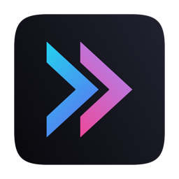

<p align="center">
  
</p>

<h1 align="center">Muxy</h1>

<p align="center">Lightweight and Memory efficient terminal for Mac built with SwiftUI and <a href="https://github.com/ghostty-org/ghostty">libghostty</a>.</p>
<p align="center"><p align="center"><a href="#install">Mac</a> | <a href="#ios-app-testing">iOS</a> | <a href="#android-app-testing">Android</a> | <a href="https://discord.gg/4eMXAmJQ2n">Discord</a></p>

<div align="center">
  
  
  
  
</div>

## Screenshots


## Features

- **Project-based workflow** — Organize terminals by project with persistent workspace state
- **Vertical tabs** — Sidebar tab strip with drag-and-drop reordering, pinning, renaming, and middle-click close
- **Split panes** — Horizontal and vertical splits with keyboard navigation and resizable dividers
- **Built-in VCS** — Simple and lightweight basic git diff and operations
- **200+ themes** — Browse and search Ghostty themes with a built-in theme picker
- **Customizable shortcuts** — 40+ configurable keyboard shortcuts with conflict detection
- **Workspace persistence** — Tabs, splits, and focus state are saved and restored per project
- **In-terminal search** — Find text in terminal output with match navigation
- **Drag and drop** — Reorder tabs and projects, drag tabs between panes to create splits
- **Auto-updates** — Built-in update checking via Sparkle
- **Text Editor** - Native, Lightweight Text (not code) Editor with code highlight support for most of the programming languages

## Requirements

- macOS 14+
- Swift 6.0+
- Ghostty installed (optional for themes)
- `gh` installed (optional for PR management)

## Install

### Homebrew

```bash
brew tap muxy-app/tap
brew install --cask muxy
```

### Manual

Download the latest release from the [releases page](https://github.com/muxy-app/muxy/releases)

### iOS app (Testing)

The iOS app is available for testers on TestFlight

- Install the iOS app via TestFlight (https://testflight.apple.com/join/7t1AaYHW)
- Open Muxy on your Mac
- Go to Settings (Cmd + `,`)
- Go to Mobile tab
- Toggle the `Allow mobile device connection`
- Open the iOS app
- Enter the IP and Port
- Approve the connection on your Mac
- Test and open issues for the bugs

**The iOS app is also open-source and the source is in this repo**

### Android app (Testing)

The Android app is a remote-control client that mirrors the iOS app. It
ships as a sideloadable APK from GitHub Releases — no Play Store / F-Droid
yet.

- Open Muxy on your Mac
- Settings → Mobile → toggle **Allow mobile device connection**
- Download `muxy-android-X.Y.Z.apk` from the
  [releases page](https://github.com/muxy-app/muxy/releases)
- On your phone, enable **Install unknown apps** for your browser or
  file manager (Settings → Apps → your-browser → Install unknown apps),
  then open the APK to install
- Open the Android app, tap **Add Device**, enter the Mac's IP and port
  (default `4865`), tap Connect
- Approve the pairing alert on your Mac

**Use only on Tailscale, a VPN, or a private network you control.** The
desktop server speaks plain WebSocket — there is no TLS, so the pairing
token and every keystroke travel in the clear.

The Android app is GPL-3.0 because it vendors Termux's
`terminal-emulator` and `terminal-view` libraries; the rest of this repo
keeps its existing MIT license. Source is at `android/`.

## Local Development

```bash
scripts/setup.sh          # downloads GhosttyKit.xcframework
swift build               # debug build
swift run Muxy             # run
```

For the Android app:

```bash
cd android
./gradlew :app:assembleDebug   # debug APK at app/build/outputs/apk/debug/
./gradlew test                 # unit tests
../scripts/checks-android.sh   # detekt + ktlint + lint + tests + assemble
```

See `android/README.md` for full Android build, signing, and security
notes.

## License

This repo is mixed-license. The macOS app (Swift sources at the repo
root, plus `MuxyMobile/`) is [MIT](LICENSE). The Android app and
everything under `android/` is GPL-3.0 because it vendors Termux's
terminal core. See `android/LICENSE` and `android/UPSTREAM` for details.
