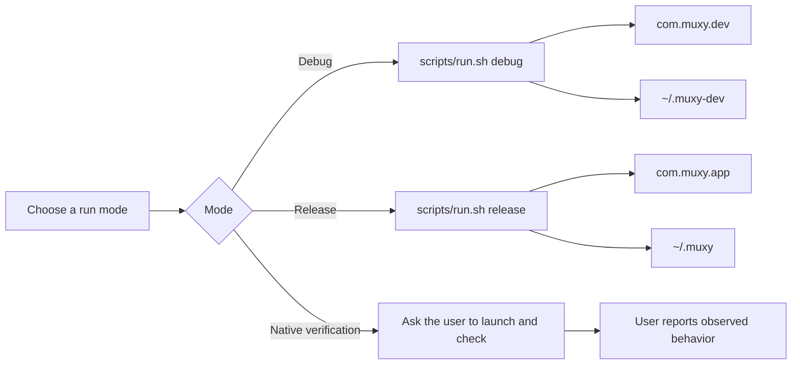
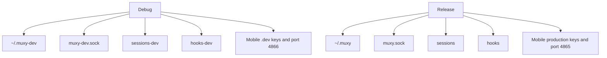
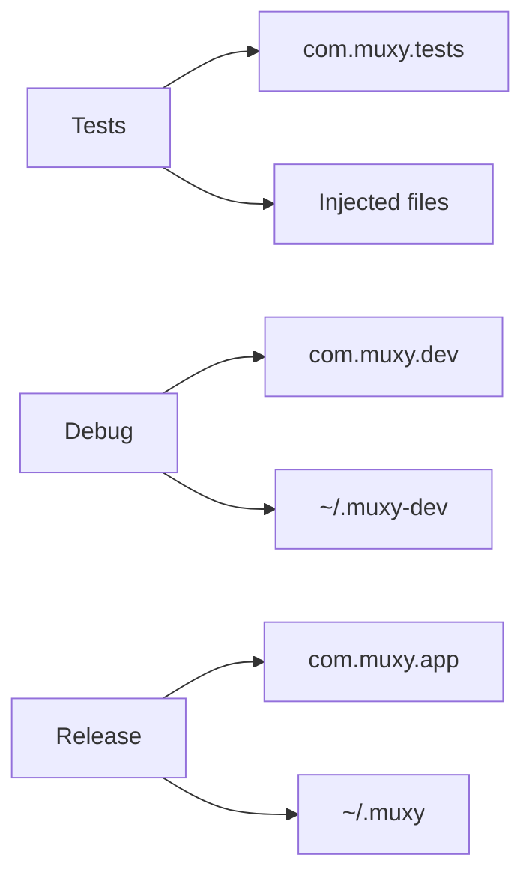

# Dev and prod isolation

## Pick the right command



| Goal | Command |
|---|---|
| Run normal development | `scripts/run.sh debug` |
| Run the release profile | `scripts/run.sh release` |
| Verify bundle structure without launch | `scripts/verify-bundle.sh target/debug/Muxy.app debug` |
| Verify native or visual behavior | Ask the user to launch the app and report the result |

Normal debug has its own bundle identity and storage root. It does not read release App Support or release defaults.

Automated tests never launch `Muxy`, `Muxy Dev`, or `MuxyTests`. `scripts/run-test-app.sh` is disabled. Staged test bundles may be prepared for user-run manual checks, but agents and verifier scripts must not launch them. See [Testing policy](testing.md).

## Storage identities

| Profile | Bundle identifier | Display name | Storage |
|---|---|---|---|
| Debug | `com.muxy.dev` | `Muxy Dev` | `~/.muxy-dev` |
| Release | `com.muxy.app` | `Muxy` | `~/.muxy` |
| Staged test | `com.muxy.tests` | `MuxyTests` | Injected ignored directory |

Release imports the retained Swift profile once, then reads and writes only `~/.muxy`. Normal debug never inspects the Swift source or the release root. See [Swift profile migration](swift-profile-migration.md) for the allowlist and retry contract.

## Why the test app looks fresh

```text
Normal app                      Test app
──────────                      ────────
Saved sidebar width             Default sidebar width
Saved projects                  No saved projects
Your preferences                Clean test preferences
```

The test app uses a separate identity and project-local files. Remove its state at any time:

```bash
rm -rf target/test-verification
```

## Build-mode contracts



Debug and release do not share normal application storage. Runtime endpoint names and mobile keys remain mode-specific as an additional boundary.

## Mobile settings

| Profile | Port key | Default |
|---|---|---:|
| Debug | `app.muxy.mobile.serverPort.dev` | `4866` |
| Release | `app.muxy.mobile.serverPort` | `4865` |

Mobile server startup is not implemented yet. That runtime work belongs to P12.

## Safety model



Tests inject their storage. Debug selects development storage by build mode. Neither accepts a production storage override merely because an environment variable is present.
