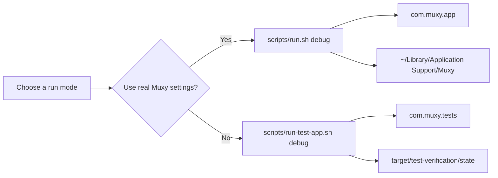
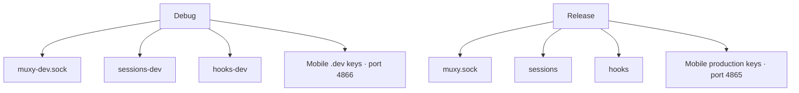
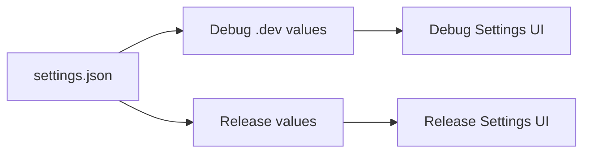
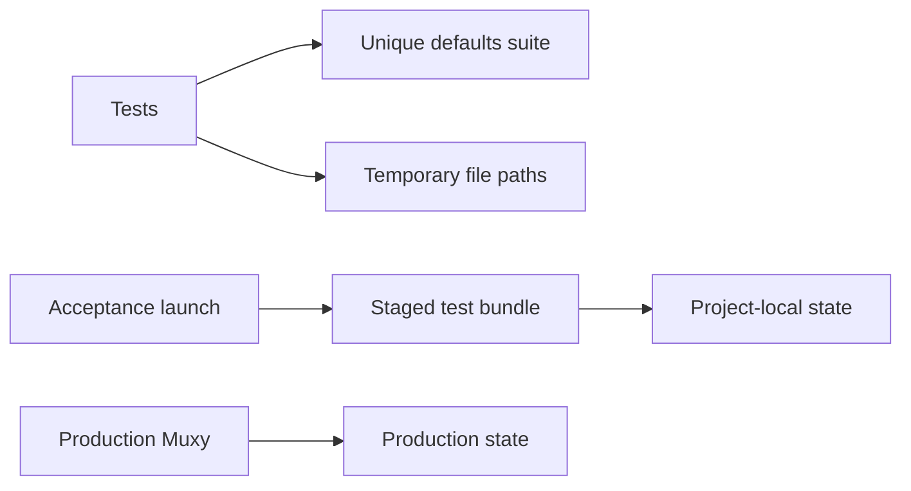

# Dev and prod isolation

## Pick the right command



| Goal | Command |
|---|---|
| Run normally | `scripts/run.sh debug` |
| Test without production settings | `scripts/run-test-app.sh debug` |
| Test the release build safely | `scripts/run-test-app.sh release` |

> `scripts/run.sh` uses your real Muxy settings. The test runner creates a staged `MuxyTests` app.

`com.muxy.tests` and `target/test-verification` are permanent test infrastructure. Every phase reuses them instead of creating phase-numbered identities.

## Why the test app looks fresh

```text
Normal app                      Test app
──────────                      ────────
Saved sidebar width             Default sidebar width
Saved projects                  No saved projects
Your preferences                Clean test preferences
```

The test app uses a separate defaults domain and project-local files. Remove its state at any time:

```bash
rm -rf target/test-verification
```

## Build-mode contracts



Normal debug and release apps still share:

- App Support
- non-mobile settings
- Ghostty configuration

Only runtime endpoint names and mobile keys differ by build mode.

## Mobile settings stay side by side



Editing one profile does not replace the other profile’s values.

| Profile | Port key | Default |
|---|---|---:|
| Debug | `app.muxy.mobile.serverPort.dev` | `4866` |
| Release | `app.muxy.mobile.serverPort` | `4865` |

Mobile server startup is not implemented yet. That runtime work belongs to P12.

## Safety model



Tests inject their storage. They do not select the production defaults domain.
