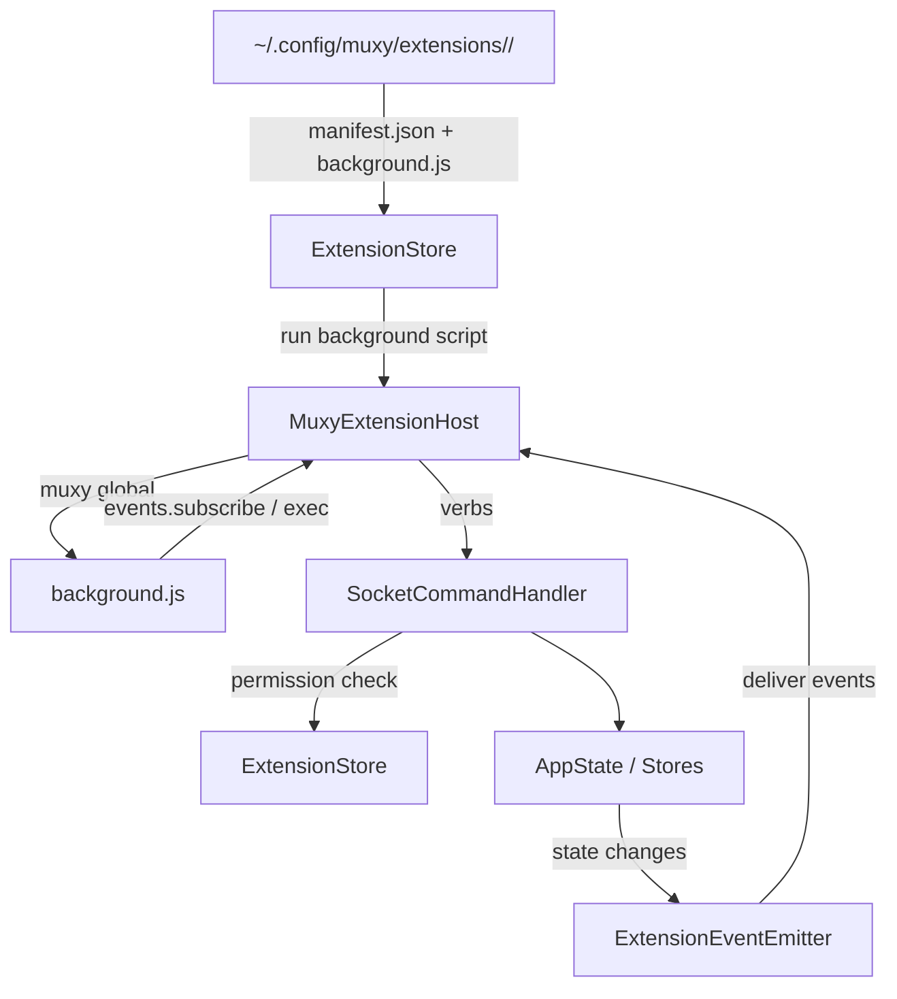

# Extensions Overview

> **Status:** under active development. The manifest format, permission set, and event wire format may change without notice. Marked **DEV** in Settings.

Extensions are user-installed directories that Muxy loads and runs. They can react to workspace events, register palette commands, and (with permission) drive the same verbs the `muxy` CLI exposes. Most extensions are manifest-only and run no process; an extension keeps a long-lived background process running only when it declares a `background` script to receive pushed events or run background shell commands.



## Pages

| Page | What's in it |
| --- | --- |
| [Manifest](manifest.md) | `manifest.json` fields, examples |
| [Permissions](permissions.md) | Permission grants and what they unlock |
| [Events](events.md) | Subscribable events, payloads, identify/subscribe handshake |
| [Palette Commands](palette-commands.md) | Declare commands that appear in the command palette |
| [AI Provider Hooks](ai-provider.md) | Route third-party notifications to a custom source |

## Where extensions live

```
~/.config/muxy/extensions/
  <name>/
    manifest.json
    background.js     # optional background script; only for pushed events / background exec
```

`ExtensionStore` scans the directory on app start, validates each manifest, and runs the `background.js` of each enabled extension **that declares one** in a long-lived host process (`MuxyExtensionHost`). Extensions without one register their UI (commands, topbar, status bar, tabs) and run `runScript` commands with no resident process. Settings → Extensions lists every loaded extension with toggle, permissions, and recent log output.

## How extensions talk to Muxy

A background script talks to Muxy through the `muxy` global the host injects — there is no socket protocol for authors to speak. It exposes:

```js
muxy.extensionID                       // the extension's name
muxy.events.subscribe(name, handler)   // receive declared events
muxy.events.unsubscribe(name, handler)
muxy.exec(argv[, options])             // run a shell command (needs commands:exec)
console.log / console.warn / console.error
```

The richer state/mutation API (`muxy.tabs`, `muxy.panes`, `muxy.projects`, `muxy.worktrees`) is available to tab/panel/popover pages via `window.muxy`, not to the background script. See [Events](events.md) for the event list and payloads.

## Process & failure model

- One long-lived background process per extension that declares a `background` script. Crashes are surfaced in Settings → Extensions; the extension is marked `stopped` until toggled or the app restarts.
- `console.*` output is captured to an in-app rolling log (last 200 lines per extension).
- Stopping Muxy terminates all extension background processes.

## Security model

- **Process isolation.** A misbehaving extension can't take down Muxy.
- **Manifest-declared permissions.** Every state-changing verb requires a matching `permissions` entry. The check happens in `SocketCommandHandler`.
- **Subscription allowlist.** An extension can only subscribe to events declared in its manifest `events` array, or to its own `command.<id>` events.
- **Loaded-from-disk only.** Muxy only runs the `background.js` of an extension it actually loaded from disk.

## Reference implementation

The bundled demo extension is the authoritative reference — see its `SKILL.md`. A background script subscribes to a few events and runs `muxy.exec` when one fires.
