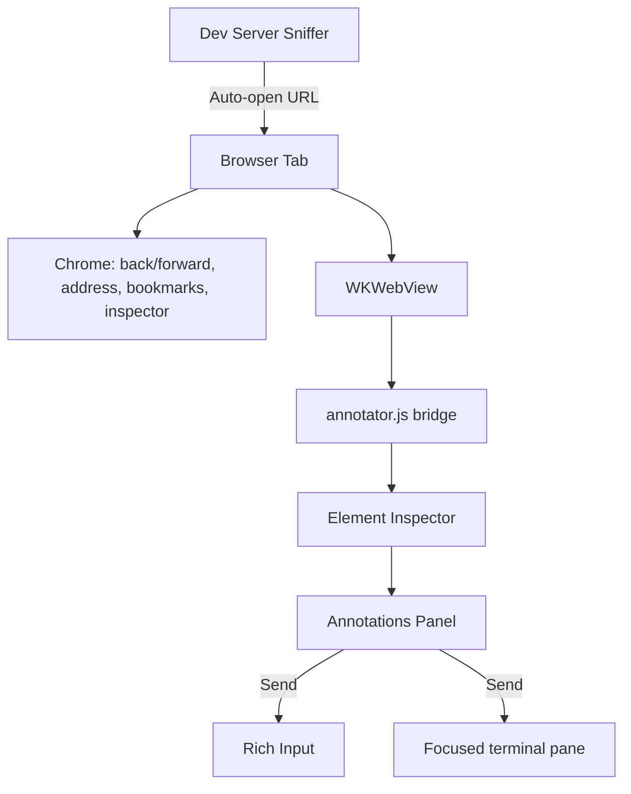

# In-App Browser

A WebKit-powered browser tab that lives next to your terminals, editor, and source-control views. Open a page, capture an element, and hand the context off to the focused agent — without leaving Muxy.

## Opening a tab

| How | Result |
| --- | --- |
| `⌘⇧B` | New browser tab in the focused pane |
| Tab strip → globe button | New browser tab |
| File menu → **New Browser Tab** | New browser tab |
| Dev server detected after `npm run dev`, `vite`, … | Auto-opens the detected URL |

A new tab loads the configured **Home page** (Google by default) and is rendered like any other tab in the worktree — drag, pin, color, split, and rename behave the same as terminal tabs. See [Tabs & Splits](tabs-and-splits.md).

## Navigation

| Action | Shortcut |
| --- | --- |
| Back / Forward | Chrome buttons, or two-finger trackpad swipe |
| Reload | `⌘R` or reload button |
| Stop | Reload button while loading |
| Find in page | `⌘F` (Enter / Shift-Enter cycle matches) |
| Zoom In / Out / Actual Size | `⌘=` · `⌘-` · `⌘0` |

The address field accepts URLs, `host:port`, localhost, or free-form queries — anything that isn't URL-like falls back to a Google search. Only `http` / `https` / `about:blank` navigations are allowed; `javascript:`, `data:`, and `file:` are blocked. A lock icon indicates the current scheme.

## Bookmarks

The bookmark menu (📑 icon) saves the current page per project. Bookmarks are persisted to `browser-bookmarks.json` under Muxy's application support directory and shown alongside a **Remove Bookmark** submenu.

## Element inspector

Click the cursor icon in the chrome (or press the same button to toggle off) to enter **pick** mode. Hovering paints a highlight; clicking captures the element into the **Elements** side panel.

Each captured element records:

- CSS selector (full path + minimal unique form) and XPath
- Text snippet and trimmed `outerHTML`
- Bounding box, viewport size, and viewport bucket (mobile / tablet / desktop …)
- Document language and direction
- Computed style (typography, color, padding, margin, border-radius)
- Linked stylesheet URLs
- An automatic screenshot saved to the cache directory

### Comments

Each annotation has an inline editor for a short note — what's wrong, what it should look like, the reference file or design.

### Style overrides

The paintbrush button opens a popover that lets you edit live CSS for the captured selector. Overrides are grouped into:

- **Typography** — family, size, weight
- **Color** — text and background
- **Padding** / **Margin** — directional inputs
- **Border** — radius

Overrides are applied via the bridge (`window.__muxyBrowserAPI.applyOverrides`) and re-applied after every navigation. Reset reverts a single property; deleting the annotation removes the entire set.

## Send to terminal

The **Send to Terminal** button on each annotation renders a markdown block and inserts it into the agent that's actually in front of you:

1. If the [Rich Input](rich-input.md) panel is visible, the markdown is appended to the active worktree's draft (and the screenshot is added as `[Image N]`).
2. Otherwise, the last active terminal pane in the worktree that owns the browser tab receives the markdown.
3. If no terminal pane exists, the markdown is copied to the clipboard and a toast explains why.

The payload uses the `@muxy-browser:` prefix and includes the URL, selector, XPath, bounding box, computed style, stylesheets, comment, and screenshot path. Sanitized to strip control characters, fence markers, and `;{}<>` from style values.

## Dev server auto-open

When a tracked command runs in a terminal pane (`npm/pnpm/yarn dev`, `vite`, `next dev`, `astro dev`, `rails s`, `uvicorn`, `flask run`, …), Muxy probes a set of common ports (3000, 4173, 5173, 8000, 8080, …) for up to ~13 seconds. The first reachable URL is opened in a new browser tab inside the **same worktree** that started the server.

Toggle this with **Settings → Browser → Auto-open Dev Servers**.

## Settings

Configured under **Settings → Browser**:

| Setting | What it does |
| --- | --- |
| Home page | URL opened for new browser tabs (defaults to Google) |
| Persist cookies and site data | Switches between the default `WKWebsiteDataStore` and an ephemeral profile |
| Clear Browsing Data | One-shot clear of cookies, cache, and storage |
| Auto-open dev server URL | Enables the sniffer described above |
| Enable Web Inspector | Exposes Safari's Web Inspector via right-click → Inspect Element (DEBUG by default) |

Persistence changes only apply to new browser tabs; existing tabs keep their current session.

## Security

- Only `http`, `https`, and `about:blank` are accepted by `BrowserURLNormalizer`. Other schemes are blocked at navigation time.
- The annotator bridge runs in a dedicated `WKContentWorld` so page scripts cannot reach the message handler.
- Captured selectors, HTML, style values, language tags, and stylesheet URLs are sanitized (control characters stripped, length-clipped, fence markers escaped) before being rendered into terminal markdown.
- The web inspector is opt-in in release builds.
