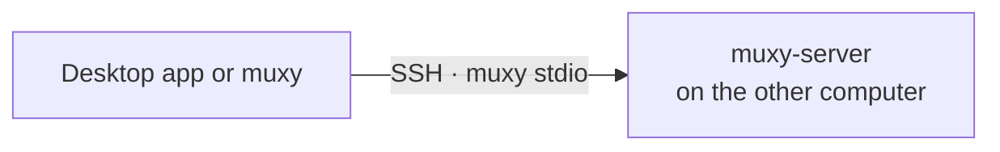

# Remote Servers

Muxy can work with projects on other computers over SSH. Each computer runs its
own `muxy-server`, so remote terminals keep running when you disconnect, just
like local ones. Remote projects sit in the same sidebar as local ones, marked
with their server.



## Requirements

- SSH access to the computer with your keys, agent, or certificates. The
  desktop app also supports password logins.
- A trusted host key. Run `ssh <host>` once to accept it.
- Muxy [installed there](../user-guide/getting-started.md#cli-and-server-only),
  on `PATH` or in `~/.local/bin`, at a version that speaks the same protocol as yours.
- macOS 14 or newer, or Linux with glibc 2.35 or newer, on x86_64 or ARM64.

On Linux hosts that end your processes when you log out, run
`loginctl enable-linger` so the server keeps running after SSH disconnects.

## In the desktop app

1. Open the **Remote** section at the bottom of the sidebar and choose
   **Add Server…**.
2. Enter the SSH host (a host name, address, or `~/.ssh/config` alias), and
   optionally the user, port, and identity file.
3. Choose **Test Connection**. If Muxy isn't installed there, the app offers to
   install the same version into `~/.local/bin`.
4. Add projects with **Add Project → Remote**, which browses the server's
   folders.

- Passwords are asked when connecting and kept only in memory until you quit.
- A dropped server reconnects on its own, waiting longer each time. It stops
  retrying when it needs you, for example for a password or a new host key.
- **Forget** a server to remove it and its projects from this app. Nothing on
  the server changes.
- The status bar shows the current project's server, with connect, restart, and
  stop.

## From a shell

Put `--host` first to use another computer's server:

```bash
muxy --host devbox                 # terminal UI
muxy --host devbox project list    # any CLI command
muxy --host ssh://me@devbox:2222   # with a user and port
```

`--host` takes `user@host`, an `~/.ssh/config` alias, or
`ssh://user@host:port`. It never prompts, so use a key or an agent. Folder
arguments must be absolute paths on that computer.

## Working with remote files

- Files dropped or pasted into a remote terminal, or sent from the
  [composer](composer.md), are uploaded and their remote path is pasted.
- `Cmd`-clicking a remote file offers a read-only copy on this Mac, or its path.
- Git runs on the server. Pull request features need `gh` installed and signed
  in there.
- AI commit and pull request actions run on this Mac, so they only work when
  the project's folder also exists here.

## Updating

Muxy never updates a remote computer by itself. When versions can't talk, the
app shows the command to run there. To update by hand, follow
the [installation instructions](../user-guide/getting-started.md#cli-and-server-only)
on that computer with `--replace`, choosing the same channel and a compatible version.
