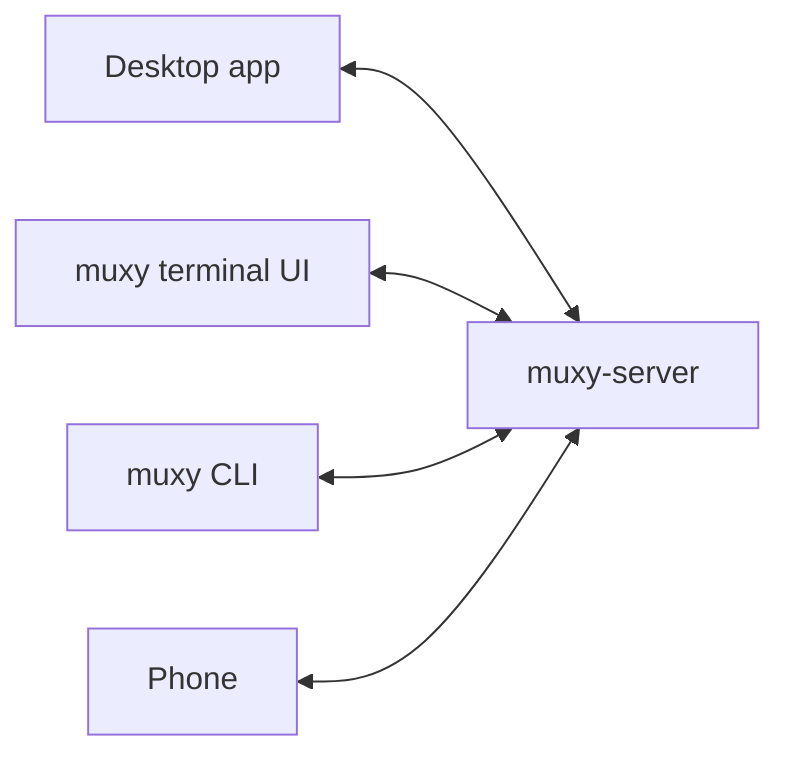

# Server

`muxy-server` runs every terminal. The desktop app, the terminal UI, the CLI,
and phones are all clients of it. That is why terminals keep running after you
quit an app, and why several apps can show the same terminal.



## Lifetime

- Apps and CLI commands start the server when they need it. You never need to
  start it yourself.
- It keeps running until you stop it, even with no app open.
- Stopping or restarting it ends every terminal. Saved screens and history are
  kept. Use the status bar, **Settings → Server**, or
  `muxy server stop --force`.
- Nothing restarts it automatically, with one exception: after an update, the
  desktop app replaces this computer's server once no terminals are running.

## Sessions

- A session is one running terminal. It belongs to the project it was created
  in, wherever you `cd` later.
- It ends when its program exits, when someone ends it, or when the server
  stops. Closing the last pane that shows it ends it too.
- Quitting an app, detaching, a crash, or sleep never ends it.
- Any number of apps can show and type into a session at once. They share one
  size.
- **Existing Terminals** lists a project's sessions that this app isn't
  showing, and which app owns each one, so you can open them here too.

## History

- The server saves each terminal's screen and scrollback to disk, even when no
  app is watching. It is still there after the program ends or the server
  restarts.
- Scrollback size is a byte budget per terminal, 16 MiB by default. Older
  history loads as you scroll.
- Ended sessions and their saved output are removed after 7 days.

## Settings

Server settings apply to everyone using that server. Change them in
**Settings → Server**, with `muxy settings set`, or in `server.toml`:

| Setting | `server.toml` key | Default |
| --- | --- | --- |
| Default shell | `default_shell` | `$SHELL`, else `/bin/zsh` on macOS and `/bin/sh` on Linux |
| History budget per session | `history_budget_bytes` | `16777216` (16 MiB) |
| Shell integration | `shell_integration` | `true` |

Shells start as login shells. Changes apply to new terminals. A new history
budget applies to saved history after the server restarts.

## Shell integration

Shell integration lets Muxy track each terminal's folder, jump between prompts,
and select a command's output. It loads automatically for zsh and fish, without
editing your startup files.

Bash is opt-in. Add this to the file your Bash profile loads for interactive
shells:

```bash
if [[ ${MUXY_SHELL_INTEGRATION:-0} == 1 ]]; then
    source "$MUXY_SHELL_INTEGRATION_DIR/muxy.bash"
fi
```

Every terminal gets `TERM=xterm-256color`, `COLORTERM=truecolor`,
`TERM_PROGRAM=muxy`, `MUXY_SERVER_ID`, and `MUXY_SESSION_ID`.

## Files

Everything lives in one profile folder:

| Platform | Stable | Beta |
| --- | --- | --- |
| macOS | `~/Library/Application Support/Muxy 2` | `~/Library/Application Support/Muxy Beta` |
| Linux | `$XDG_STATE_HOME/muxy`, or `~/.local/state/muxy` | `$XDG_STATE_HOME/muxy-beta`, or `~/.local/state/muxy-beta` |

| File | What it holds |
| --- | --- |
| `server.toml` | Server settings |
| `server.log` | Server log |
| `server.sock` | The socket apps connect to |
| `sessions/` | Projects, sessions, and saved terminal output |
| `remote.json` | Mobile access settings and paired phones |
| `settings.toml`, `terminal.toml`, `themes/` | Desktop app settings, see [Settings](../user-guide/settings.md) |
| `tui-state.json` | Terminal UI layouts |

Set `MUXY_DIR` to use a different profile folder. Development builds use
`Muxy Dev` (`muxy-dev` on Linux), so they never touch your real data.
