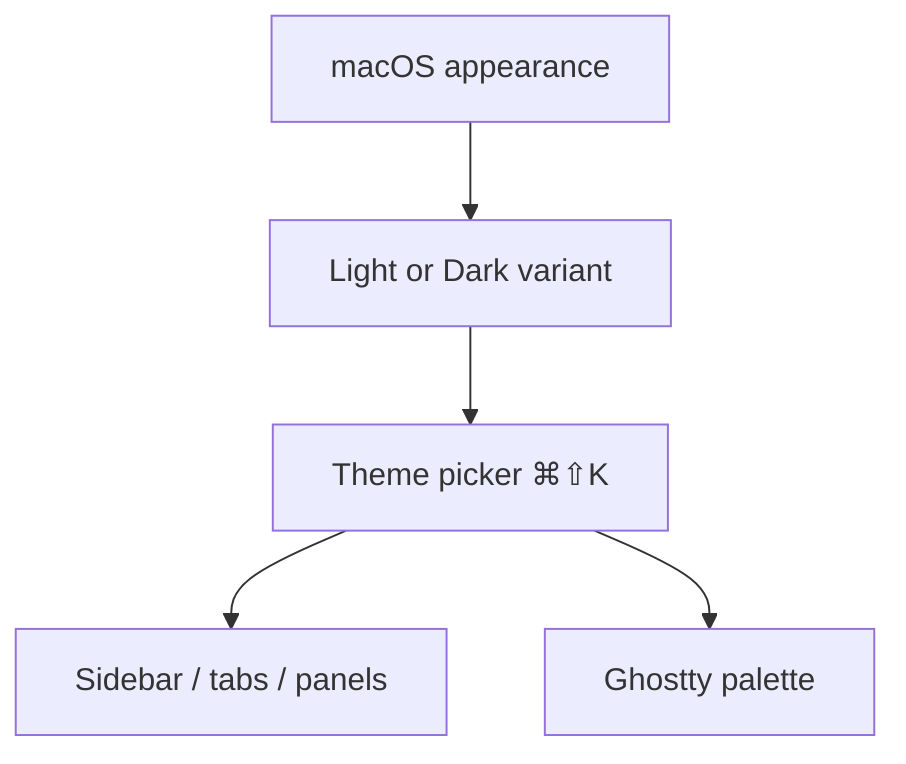

# Themes

Muxy uses a paired light / dark theme model. The chrome (sidebar, tabs, panels) and the terminal share the same color palette so everything stays visually consistent.

## Theme picker

Open with `⌘⇧K` (or click the theme button in the topbar). Muxy stores separate choices for:

- **Light Terminal Theme**
- **Dark Terminal Theme**

The active variant follows macOS appearance automatically, so your dark choice and light choice are remembered independently.

## Ghostty colors

Muxy's active Ghostty config is `~/Library/Application Support/Muxy/ghostty.conf`. On first launch Muxy seeds it from `~/.config/ghostty/config` when that file exists; after that, Muxy reads and writes its own copy. When you change theme in Muxy, the matching light/dark variant is applied automatically. To customise the palette directly, edit Muxy's config — see [Ghostty's theme docs](https://ghostty.org/docs/config/reference#theme).

## Reload

After editing Muxy's Ghostty config, **Muxy -> Reload Configuration** (`⌘⇧R`) re-reads it without restarting.
