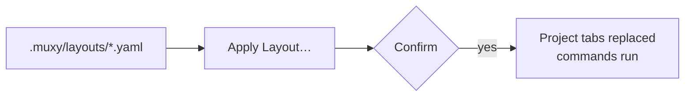

# Layouts Overview

A layout is a file in your project that describes a tab of split terminals.
Check it in, and anyone on the project can open the same workspace with one
click.



## Pages

| Page | What's in it |
| --- | --- |
| [Schema](schema.md) | Fields, splits, and the JSON form |
| [Examples](examples.md) | Ready-to-copy layouts |

## How it works

- Put layout files in `.muxy/layouts/` inside a project or worktree folder.
  Remote projects work too.
- Use `.yaml`, `.yml`, or `.json`. The file name, without its extension, is the
  layout's name.
- Apply one from the project's menu with **Apply Layout…**, or from the layout
  button in the tab bar. The button appears when the project has at least one
  layout.
- Layouts are never applied automatically.
- Applying asks first, then replaces all of the project's tabs in this app,
  pinned tabs included, and runs the layout's commands. Terminals that no app
  shows anymore end.
- Layouts are a desktop app feature. The `muxy` terminal UI does not read them.

Only apply layouts you trust: their commands run as you.

```
my-project/
  .muxy/
    layouts/
      dev.yaml
      release.yaml
```
