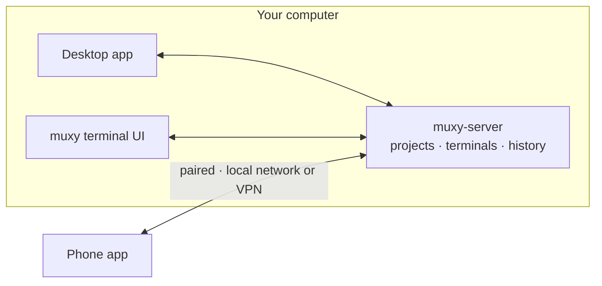

# Muxy

Muxy is a terminal multiplexer. You organize your work into projects and work
in tabs and split panes. Terminals run in a background server, so they keep
running when you close the app, and several apps can show the same terminal at
once.

Three ideas explain most of Muxy:

- **The server owns the work.** Projects and terminal sessions live in the
  server, not in the apps.
- **Each app owns its view.** Tabs, split layouts, workspaces, and project order
  are private to each app.
- **Terminals outlive apps.** Quitting or crashing an app never ends a terminal.
  Closing the last pane that shows it does.

## Read next

1. [Product model](./product-model.md): projects, workspaces, worktrees, tabs,
   panes, and sessions.
2. [App model](./app-model.md): the apps, navigation, settings, and updates.
3. [Server model](./server-model.md): how terminals live, are shared, and end.

How it is built: [technical design](../tech/README.md).
