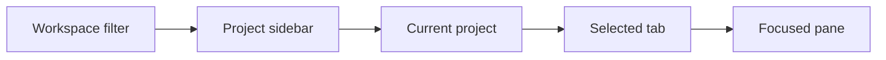

# App model

Composer keeps a draft for each server and project, including its files and copied
images. Its panel can be pinned or floating at the right or bottom of the workspace.
It sends to the active terminal or the visible split terminals; failed sends preserve
the draft. Optional on-device dictation inserts text into the draft without sending it.

Native picker modals support searchable lists, streamed items, and dynamic queries.
Selection returns the chosen item; dismissal or replacement cancels the picker.

Webview tabs retain their pages while switching tabs and projects. Their identity
and data are saved; unavailable content shows a placeholder. Webview panels dock
at the right or bottom, pinned or floating, with shared move, resize, pin, and
close controls. Their pages remain alive until closed. Webview modals return a
result or cancel on dismissal or replacement. Pages receive live theme, data,
and focus updates and may veto user closes.

Settings → Extensions manages installed packages and the marketplace. Users can
load an unpacked folder, install a package, and enable it after reviewing its
permissions. Reloading, disabling, and uninstalling honor open views’ close
handlers. The first compatibility target is main’s unchanged Git and Files
extensions; other extension capabilities remain deferred.

The desktop and keyboard TUI are clients of the same server. The
[product model](./product-model.md) defines what clients own; this document
defines how users navigate and manage their views.

## Clients and servers

The desktop bundles the same `muxy` CLI/TUI and `muxy-server` executables
provided for standalone use. Either client connects to the server on its
machine, starting it if needed. Remote connections are deferred; users can
already SSH to another machine and run `muxy` there.

The model allows clients to organize several servers later. A project routes
to its `server_id`, and its panes inherit that route. Changing projects may
therefore change the responsible server. There is no global active-server
selection or sidebar server selector. Servers are managed in Settings, with
the current device selected by default.

## Layouts and restoration

Desktop and TUI keep separate layouts and workspaces while sharing access to
server projects and sessions. Several TUI instances can open the same saved
TUI layout concurrently; layout changes need not appear live in another
instance. Opening an existing session adds it to the client's layout; sessions
from another client are discoverable within their project.

Existing Terminals lists sessions in the selected project that this client is
not attached to and shows their owner, or No owner. The desktop tabstrip provides
a stack-icon button, hidden when none are available. Its keyboard shortcut is
Command–Option–T by default and can be configured in settings. The TUI shows availability
beside its tabs and keeps its keyboard picker.

On launch, desktop restores every project, its tabs, and window view state. It
never creates a tab automatically. The TUI's first launch opens one shell in
Home; later launches restore its saved project and layout.

The desktop currently opens one workspace window and a reusable Settings
window. Multiple workspace windows, including the same project in two windows,
and side-by-side tab layouts may be added later without changing ownership.

## Navigation and focus

The sidebar defaults to **All projects**, listing each top-level project once.
A workspace filter restricts that list to its members; Home always stays first.
One user-defined top-level order applies under every filter. Worktree children
appear beneath their parent. Selecting a top-level or worktree project changes
the current directory context and visible tab set. Filtering never changes
project ownership or execution context.

The current project, selected tab, and focused pane belong to the window.
There is one active pane for the whole window, even if several tabs are visible.
A tab displays its custom title when set. Otherwise it displays that pane's title
when it contains the active pane, or its first pane's title.

Closing the active pane focuses an adjacent pane in its tab. Closing the whole
tab focuses the first pane of the next tab, or the previous tab if there is no
next tab. Closing an inactive pane or tab never steals focus. Normal tab
selection may restore a pane from the window's focus history.

## Disconnected and ended sessions

An unreachable server leaves the project loaded and app-only panes usable.
The bottom status bar always shows the current project's server status at the
far right, beside updates. Its upward-opening panel offers restart and stop
with confirmation, or connect while disconnected. Terminal panes retain their
last available content. Existing project edits and closes remain available
while disconnected and replay in order on reconnection.

When a terminal session ends, every client immediately removes its panes,
including those in inactive tabs and projects. Closing the last pane closes
its tab; other panes remain. Relaunching or reconnecting removes references
to sessions that have ended or been discarded, without restarting them. See the
[server model](./server-model.md#closing-panes) for close and retention rules.

Quitting or detaching leaves sessions running. **End All Sessions and Quit**
ends all live sessions on the current-device server and clears terminal panes
and their saved content before quitting. App-only panes remain, including in
mixed tabs.

## Settings window

Settings is one reusable app-level window, separate from project tabs. It
remains available while disconnected and never changes project, tab, or pane
selection. It uses the active theme, searchable categories, and controls that
apply changes immediately without relaunching.

App preferences live in `settings.toml`, terminal preferences in `ghostty.conf`,
and custom themes in `themes/`. Keyboard shortcuts share one overridable action
system, including contexts and aliases for app actions, fields, menus, pickers,
and buttons. Ordinary terminal keystrokes remain terminal input.

Server settings apply to the selected server. Stopping or restarting it requires
confirmation. Existing saved settings panes are removed on restore without
affecting neighboring terminal panes or sessions.

## App updates

Compatible app updates preserve running sessions. The bundled server is
replaced when all sessions end, including idle shells and detached sessions.
Server settings show pending server updates.

An incompatible beta update may wait for all sessions to end. This schedules
installation and app restart while the app runs; users can cancel it. Updating
immediately requires confirmation that all terminal processes on the device
will end and their terminal panes will close.

## AI indicators and notifications

For Git projects, the desktop footer shows the current branch and changes, an
AI-assisted commit action, and either Create PR or the current pull request.
A selected installed AI CLI drafts commit or pull request text; users review and
edit it before Muxy commits, pushes, or opens the pull request. Providers and
prompts are set in Settings → AI. The pull request control shows its state and
checks and offers refresh, open, update, merge, and close actions.

Activity indicators, progress, and notifications belong to open panes, including
those in hidden tabs. Tabs and projects aggregate their panes only; detached
sessions contribute no indicators or desktop alerts. Blocked agents take priority
over working agents and unread completions. Removing a pane removes its signals
from its tab and project; ending a session clears them everywhere.

Viewing a session in the active desktop acknowledges its pending event for every
client. Desktop notifications announce new background attention and completion
events; reconnecting restores pending indicators without replaying old alerts.
There is no in-app notification list or saved notification history.
The TUI shares the protocol but its AI presentation is deferred.
