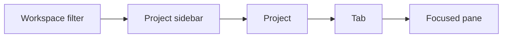
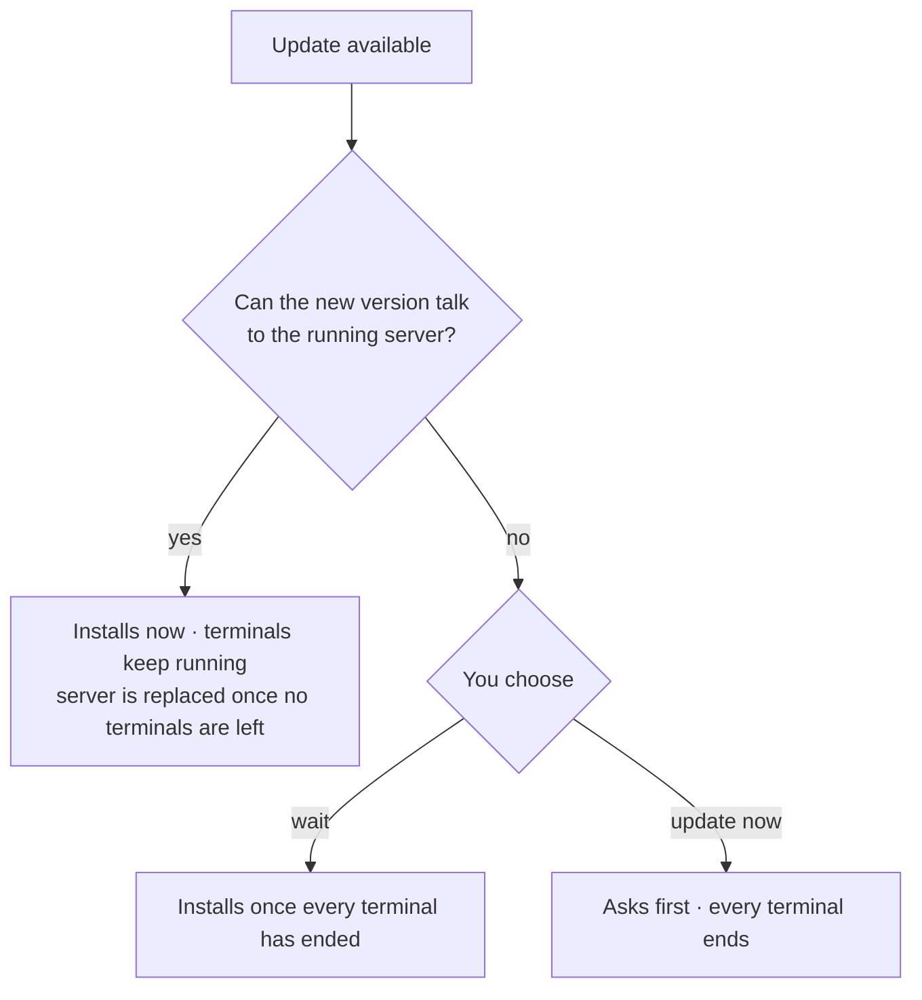

# App model

How people use Muxy: the apps, navigation, settings, and updates.

## The apps

| App | Connects to |
| --- | --- |
| Desktop app (macOS) | The server on the same computer, starting it if needed, and the servers of remote devices over SSH. |
| `muxy` terminal UI | The server on the same computer, starting it if needed, or with `--host`, the server on another computer over SSH. Ships with the desktop app and also on its own. |
| Phone app | A paired computer's server, over the local network or a VPN, or any computer's server over SSH. |

Every project knows which server it lives on, so the desktop app shows
projects from several servers in one sidebar. Remote projects are marked with
their server and path. There is no global "current server".

The **Remote** section at the bottom of the sidebar shows each remote server's
state. Its popover adds servers (host, user, port, key file, or a password that
Muxy asks for and keeps only in memory) and manages them. **Add Project →
Remote** browses that server's folders. When a server lacks Muxy, a released
app offers to install the same version there; when its version can't talk to
the app, the section explains how to update it. Removing a server only forgets
its projects in this app.

**New Tab in Project…** (⌘⇧N) lists local and remote projects. Picking one
opens a tab there and switches workspace if needed; a remote server opens in
its Home, connecting first if needed. Clicking a server in the Remote popover
offers **New Tab** too.

Files and images dropped or pasted on a remote terminal, or sent from the
composer, are copied to that computer and its path is pasted. Clicking a file
path in a remote terminal offers a read-only copy here, or its path.

Each app keeps its own layout: tabs, splits, workspaces, and project order.
Projects and terminals are shared. Several `muxy` windows can open the same
terminal UI layout.

## Navigation


```mermaid
flowchart LR
    FILTER["Workspace filter"] --> SIDEBAR["Project sidebar"]
    SIDEBAR --> PROJECT["Project"] --> TAB["Tab"] --> PANE["Focused pane"]
```

- The sidebar shows **All projects** by default. Pick a workspace to filter it.
  Home stays first and worktrees appear under their parent.
- One project order applies under every filter.
- Picking a project shows its tabs.
- A window has one focused pane. Closing it moves focus to a neighbor. Closing a
  tab moves focus to the next tab, or the previous one. Closing something in the
  background never steals focus.

## Opening and restoring

- The desktop app restores all projects, tabs, and window state on launch. It
  never opens a tab by itself.
- The terminal UI opens one shell in Home the first time, then restores its
  layout.
- `muxy <folder>` opens the folder in the desktop app, selecting its project or
  adding one. Without the desktop app, or over SSH, it opens in the terminal UI.
- **Existing Terminals** lists a project's terminals that this app isn't
  showing, and which app owns each one. Opening one adds it to your layout.

## Worktrees

New Worktree has a name, a new or existing branch, and Default, Template, or
Folder location choices. Worktrees default to `~/.muxy/worktrees/<project>/<name>`.
Settings → General sets the global location; each project remembers its choice. Templates support `{branch}`, `{base-dir}`, and `{project-name}`.

Optional setup and teardown commands come from the source project's
`.muxy/worktree.json` and `$XDG_CONFIG_HOME/muxy/worktree.json` (by default,
`~/.config/muxy/worktree.json`):

```json
{ "setup": ["npm ci"], "teardown": ["docker compose down"] }
```

Review and enable commands when creating or removing a worktree; `muxy worktree`
runs them only with `--hooks`. Setup runs per-machine commands first; teardown
runs project commands first. Commands run in the worktree, with
`MUXY_PROJECT_PATH` and `MUXY_WORKTREE_ID`, `MUXY_WORKTREE_PATH`,
`MUXY_WORKTREE_NAME`, and `MUXY_WORKTREE_BRANCH` available.
A setup failure keeps the new worktree; a teardown failure stops removal.

## When things go away

| Situation | What you see |
| --- | --- |
| The server is offline | Projects stay visible, terminals keep their last screen, and web panes keep working. Edits and closes are replayed on reconnect. |
| A remote server drops | Its section shows it offline and it reconnects on its own, waiting longer each time, until a login or host key needs you. Its projects never show as failed while offline. |
| A project's folder is gone | The project shows as failed, also on a remote server. |
| A terminal ends | Its panes close in every app, including hidden tabs. |
| You quit or detach | Terminals keep running. |
| **End All Sessions and Quit** | Every terminal on this computer ends and its panes close. Other panes stay. |

The status bar shows the current project's server, with connect, restart, and
stop.

## Settings

- Settings is one window, separate from projects. It works while offline, and
  changes apply immediately.
- App preferences live in `settings.toml`, terminal preferences in
  `terminal.toml`, and custom themes in `themes/`.
- Every app shortcut can be changed in Settings → Keyboard. Terminal key
  bindings are set in Settings → Terminal, and the Quick Terminal
  shortcut has its own setting. Normal keystrokes in a terminal always go to
  the terminal.
- **Settings → Appearance → App language** picks the interface language. English
  is built in; other languages come from language-pack extensions, the same ones
  made for Muxy 1.x. Untranslated text stays English, and while the chosen pack is
  unavailable Muxy shows English.
- Server settings, such as the shell and history size, apply to this
  computer's server. `muxy --host` changes another computer's. Stopping or
  restarting it asks first.
- **Settings → Mobile** turns phone access on, shows a pairing code, and lists
  paired phones. `muxy mobile` does the same without the desktop app.
- **Settings → Backup & Restore** exports settings, themes, extension preferences,
  projects, and layouts. Restore applies on the next launch and keeps a recovery
  copy in `Backups`. Existing projects are kept; matching projects receive the
  saved layouts. Server settings take effect after restarting the server.
- Import supported 1.x settings and local projects from the installed app, a
  `.muxy` backup, or `settings.json`. Unsupported options are listed before import.
  A 1.x import adds to what is already there: existing projects, tabs, and
  workspaces are kept. A profile with no projects yet imports the installed 1.x
  automatically, once, including its extensions.
  Config files open in the system editor. Backups exclude live terminal sessions,
  paired-device credentials, extension packages, and project files. They keep
  the list of remote servers but not remote projects, which come back from
  their server.

## Updates


```mermaid
flowchart TD
    UPDATE["Update available"] --> FITS{"Can the new version talk<br/>to the running server?"}
    FITS -->|"yes"| NOW["Installs now · terminals keep running<br/>server is replaced once no terminals are left"]
    FITS -->|"no"| CHOICE{"You choose"}
    CHOICE -->|"wait"| LATER["Installs once every terminal has ended"]
    CHOICE -->|"update now"| FORCE["Asks first · every terminal ends"]
```

When the new version can talk to the running server, checking **Also restart
the server** in the update dialog replaces the server now too. Every terminal
ends.

## Desktop features

- **Composer.** Write a draft, with files, images, or dictation, and send it to
  the active terminal or to every visible split. Each project keeps its own
  draft, and a failed send keeps it.
- **Web views.** Extension pages as tabs, docked panels, popovers, or dialogs.
  They stay alive while hidden. Extension panels belong to a project: switching
  projects closes them, and switching back reopens them.
- **Extensions.** Add tabs, panels, a sidebar, toolbar and status bar items,
  shortcuts, and background scripts. They are managed in Settings → Extensions,
  declare their permissions, and ask before sensitive actions. Extensions made
  for Muxy 1.x work unchanged.
- **Git and AI.** For Git projects, the footer shows the branch and changes,
  commits and pushes with an AI-written message, and creates or manages pull
  requests. It uses an AI command-line tool you already have, chosen in
  Settings → AI.
- **Tips.** The sidebar shows a tip, picked at random on launch. Hide tips from
  the card or in Settings → Appearance.

## AI agents

The server recognizes AI coding agents running in terminals and whether each
one is working, waiting for you, or done.

- Tabs, worktrees, and projects show the state of their agents, and "waiting
  for you" comes first.
- The desktop app notifies you about agents in the background. Looking at the
  terminal clears the alert in every app.
- Detached terminals show no alerts, and no notification history is kept.
