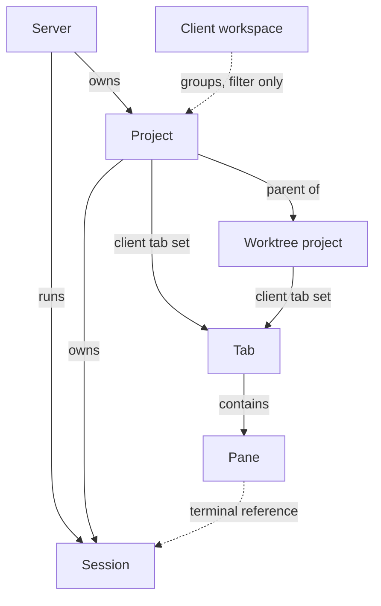

# Product model

This document defines Muxy's entities and ownership rules. Client behavior is
in the [app model](./app-model.md); terminal lifetime and history are in the
[server model](./server-model.md).

## Relationships and ownership

| Entity | Meaning and ownership |
| --- | --- |
| Server | Owns projects, shared metadata, terminal sessions, and server settings. |
| Project | A server-owned identity pointing to a directory on that server. |
| Workspace | A client-owned collection of ordinary top-level projects; collections may overlap. |
| Worktree project | A child project with `type = worktree` and a `parent_id`. |
| Tab | A client-owned container belonging to one project, with at least one pane. |
| Pane | One typed content view belonging to exactly one tab. A terminal pane references a session in its project. |
| Session | A terminal process with a server-generated ID and exactly one owning project. |

Clients own workspace memberships, project order, tabs, pane layouts, and
presentation state. Shared project metadata and deletions reach every client.
Changing a terminal's working directory never changes this ownership.

## Project identity and location

A generated project ID defines identity. The server and directory define
location. Each project also has a name, optional symbol or emoji icon, optional
logo image, assigned color, nullable `type`, and nullable `parent_id`. New names default to the directory
name; clients can edit shared names, icons, logos, and colors.

Two projects may point to the same server and directory. They share the files
and Git state there, while retaining distinct identities, metadata, and client
tab sets. Neither is an alias of the other. Each may independently register the
same Git worktree as a child project.

## Home project

Each server has one protected top-level Home project pointing to that server
user's home directory. It owns Quick Terminal and other ad-hoc sessions. It
cannot be deleted, have children, or belong to a workspace. Clients may also
keep app-only panes in Home. A remote server has its own Home identity and path;
a server can never have zero projects.

## Workspaces

Workspaces may be empty and may group ordinary top-level projects from several
servers. Projects may be ungrouped or belong to several workspaces. Memberships
are private to the client. Deleting a workspace does not affect its projects.
Sidebar filtering and ordering are defined in the
[app model](./app-model.md#navigation-and-focus).

## Worktree projects

An ordinary top-level project has null `type` and `parent_id`. Its directory is
the main working directory, whether or not it uses Git; no implicit child
record is created for a non-Git project.

A Git worktree is another project record, with `type = worktree`, its parent's
ID, and its own directory. It uses the same server as its parent and cannot
itself be a parent: nesting depth is one. A top-level project may have any
number of worktree children. The generic parent relationship allows other
child-project types to be defined later.

The app can create a worktree from a branch and directory or register an
existing Git worktree. Its name defaults to the branch name and its color to
its parent's. Each child has its own client tab set.

## Failed projects and deletion

A project whose directory no longer exists loads in a failed state. A worktree
project also requires its Git worktree to exist. Only deletion is available in
this state. An unreachable server does not imply a failed project.

- Deleting a project removes it from every client and ends and discards its
  sessions, including those displayed elsewhere. Confirmation explains this
  impact. Its directory and files remain untouched unless the user chooses
  worktree removal below.
- Deleting a worktree project offers to also remove its path and Git worktree,
  or leave them orphaned on disk.
- Deleting a top-level project also deletes its children and their tabs. Their
  paths and Git worktrees are never touched.
- Home cannot be deleted.

## Tabs and panes

A project may have no tabs. Each tab contains one or more panes arranged by
horizontal or vertical splits at any depth; the arrangement is saved. Tabs
may have a custom title, color, and pin. Otherwise,
[window focus](./app-model.md#navigation-and-focus) determines their displayed
title. Pinned tabs stay first and are protected from user closes until unpinned;
their panes still disappear when sessions end. Closing the last pane closes its tab.

Pane types are either app-only, such as a web view, or server-bound, such as a
terminal. A server-bound pane inherits its server and directory context through
its tab's project. Extension views may be either kind; other types may be added.
The desktop supports terminal and webview panes, webview panels, popovers, and
modals, and a separate app-level Settings window. Extensions load in the app,
which enforces their declared permissions and asks before sensitive actions.

Terminal panes support selection, clipboard, search, links, mouse reporting,
input methods, and shell integration. A pane's title uses the program-set
title, otherwise the foreground process name, otherwise its current directory.
Shell integration enables jumping between prompts and selecting command output
without its prompt; users can disable it in server settings.

A new terminal starts in its project's directory or, if the setting enables it,
in the current directory of the pane it was split from. Closing and retaining
terminal content follow the [session rules](./server-model.md#closing-panes).
Tabs may be reordered within their project. Moving tabs or panes between
containers is deferred.
