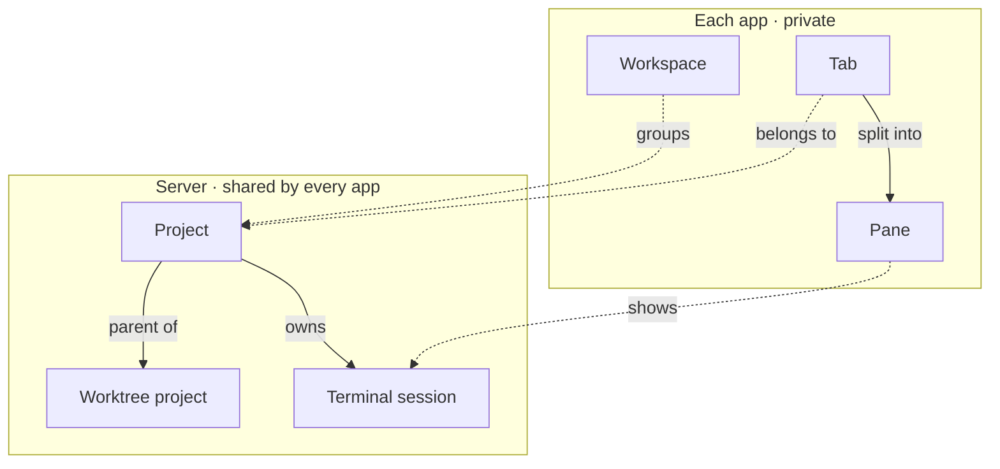
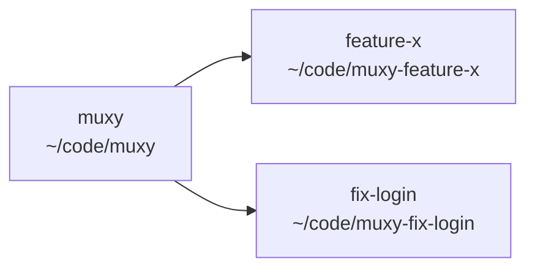

# Product model

The things Muxy is made of, and who owns them.

## The pieces


```mermaid
flowchart TB
    subgraph SERVER["Server · shared by every app"]
        PROJECT["Project"]
        WORKTREE["Worktree project"]
        SESSION["Terminal session"]
        PROJECT -->|"parent of"| WORKTREE
        PROJECT -->|"owns"| SESSION
    end
    subgraph APP["Each app · private"]
        WORKSPACE["Workspace"]
        TAB["Tab"]
        PANE["Pane"]
        TAB -->|"split into"| PANE
    end
    WORKSPACE -.->|"groups"| PROJECT
    TAB -.->|"belongs to"| PROJECT
    PANE -.->|"shows"| SESSION
```

| Piece | What it is |
| --- | --- |
| Server | Runs on a computer. Owns projects, terminal sessions, and server settings. |
| Project | A folder on a server, with a name, color, and optional icon or logo. |
| Home | The built-in project for your home folder. |
| Worktree project | A Git worktree, shown under the project it came from. |
| Workspace | A group of projects in one app, used to filter the sidebar. |
| Tab | Belongs to one project and holds one or more panes. |
| Pane | One view in a tab: a terminal, a web page, or an extension view. |
| Session | A running terminal. Belongs to exactly one project. |
| Paired device | A phone allowed to connect to the server. |

**Shared or private.** Project names, icons, colors, and deletions reach every
app. Tabs, layouts, workspaces, and project order stay in the app that made
them.

## Projects

- A project is an identity that points to a folder. Two projects can point to
  the same folder. They share its files but are otherwise separate.
- A new project is named after its folder. Its name, icon, logo, and color can
  be changed.
- If the folder disappears, the project shows as failed and can only be
  deleted. An offline server does not make its projects fail.
- Changing directory inside a terminal never moves it to another project.

## Home

Every server has one Home project for the user's home folder. Quick Terminal
and other one-off terminals live there. Home is always first in the sidebar. It
can't be deleted, have worktrees, or join a workspace.

## Workspaces

A workspace is a named filter for the sidebar. A project can be in no
workspace, one, or several, and a workspace can be empty. Deleting a workspace
never touches its projects.

## Worktrees

A worktree project is a child of a normal project, pointing to a Git worktree's
folder. You can create one from a branch or add a worktree that already exists.
It takes the branch name and its parent's color, and has its own tabs.
Worktrees can't have children of their own.

Worktrees made outside Muxy show up automatically. A new project shows
worktrees only if its repository already has some; turn them on or off from
the project menu.

After a worktree is deleted outside Muxy, its entry is removed automatically
if it has no tabs in this app and no terminal history.


```mermaid
flowchart LR
    PARENT["muxy<br/>~/code/muxy"] --> FEATURE["feature-x<br/>~/code/muxy-feature-x"]
    PARENT --> FIX["fix-login<br/>~/code/muxy-fix-login"]
```

## Deleting

Deleting always asks first and explains what will end.

| You delete | What happens |
| --- | --- |
| A project | It disappears from every app and its terminals end. Files stay on disk. |
| A worktree project | The same, and its worktree folder is removed too. |
| A project with worktrees | Its worktree projects are deleted too. Their folders stay on disk. |
| Home | Not allowed. |

## Tabs and panes

- A project can have any number of tabs, including none.
- A tab splits into panes, side by side or stacked, as deep as you like.
  Closing its last pane closes the tab.
- Drag a tab to an edge of the content to show it beside the others in a new
  group. Each group has its own tab strip.
- Closing a group's last tab removes the group.
- Tabs can have a custom title and color, and can be pinned. Pinned tabs stay
  first and can't be closed until unpinned.
- A terminal's title is the one its program sets, otherwise the running
  program's name, otherwise its folder.
- New terminals open in the project's folder, or optionally in the folder of
  the pane they were split from.
- Terminals support selection, copy and paste, search, links, the mouse, input
  methods, and shell integration: jump between prompts and select a command's
  output.

## Project layouts

Named layouts live in `.muxy/layouts/` inside a project or worktree. Use YAML,
YML, or JSON files; the filename is the layout's name. Choose **Apply Layout…**
from the project menu or the layout button in the top bar. Layouts are never
applied automatically. Confirmation replaces that project's tabs in this app;
terminals still shown by another app keep running.

```yaml
layout: horizontal
panes:
  - tab:
      name: editor
      command: nvim .
  - layout: vertical
    panes:
      - tab: npm run dev
      - tab:
          name: shell
```

`horizontal` means side by side; `vertical` means stacked. Splits can be nested.
A leaf's `tab` is a command string or an object with optional `name` and `command`.
Commands run in the project folder; a command list is joined with `&&`. Legacy
`tabs` lists keep their extra entries as separate top-level tabs.
