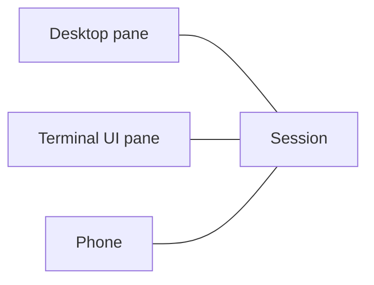
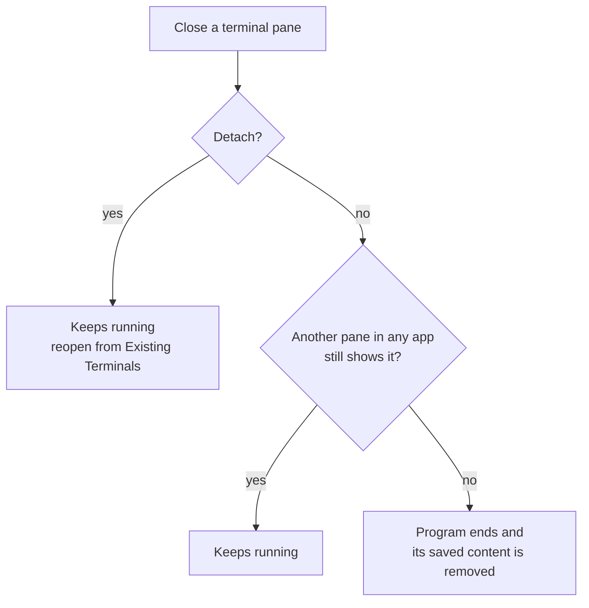
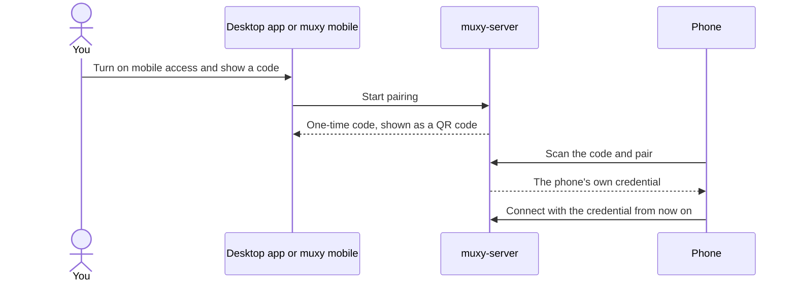

# Server model

`muxy-server` runs the terminals for every app. It runs on its own, apart from
the apps.

## Lifetime

- An app starts the server if it isn't running. The server keeps running until
  it is stopped, or until an update replaces it once no terminals are left.
- Stopping or restarting it ends every terminal but keeps settings and each
  terminal's saved content. Nothing is ever restarted automatically.

## Sessions

Local macOS sessions can start as [sandboxed terminals](./sandbox.md), with a
workspace boundary, approved tools and a fixed network policy.

A session is one terminal. It belongs to the project it was created in; its
current folder never changes that.

A session keeps running until its program exits, someone ends it, or the server
stops. Closing the last pane that shows it also ends it. Quitting an app, a
crash, detaching, or the computer sleeping never ends it, and there is no
timeout.

## Sharing a session

- Any number of apps can show a session and type into it at once. They share
  one size.
- The first app to attach is the session's owner. When it leaves, the next one
  takes over. Ownership only labels the session in Existing Terminals; it grants
  nothing extra.
- Panes in background tabs stay attached.

## Closing a pane

- If a program other than the shell is running, you confirm once. Background
  jobs alone don't ask.
- If the server is offline, the close waits and is decided on reconnect.
- Ending a session or deleting its project affects every app, unlike closing
  one pane.

## History

- Attaching shows the current screen and recent history. Older history loads as
  you scroll.
- History size is a byte budget in server settings. The server reports how many
  rows it holds.
- The server saves each terminal's screen and history, even when no app is
  watching, so it is still there after the program ends or the server restarts.
  A crash may lose the last moments of output.
- Ended sessions and their saved output are automatically removed after 7 days.
  `muxy session list` shows live sessions; use `--all` to include saved ones.

## Git and files

The server runs Git and file operations for its projects, such as worktrees,
changes, and reading files. Every app, including phones, sees the same
repository and files.

## AI activity

- The server spots supported AI agents from the running program and what's on
  screen. It needs no plugins and works while no app is attached. Recognition
  is best effort.
- It keeps at most one unread event per session, in memory only. Once seen, an
  event is cleared for every app. Restarting the server clears everything.

## Mobile access

- Mobile access is off until you turn it on.
- A pairing code works once, for five minutes, and only while it is on screen.
- A paired phone can do what a terminal on the computer can, except manage
  mobile access, change server settings, stop the server, or run extension
  commands.
- Revoking a phone, or turning mobile access off, disconnects it at once.
- A phone can pair with a server on another computer too, with
  `muxy --host <computer> mobile pair`.
