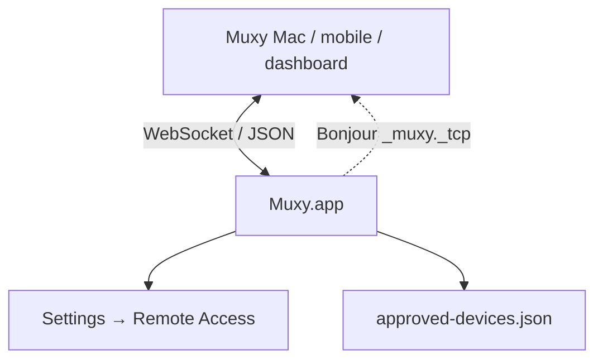
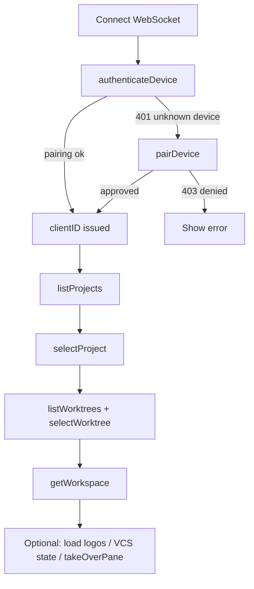

# Remote Server Overview

Muxy embeds a WebSocket server that lets other Muxy Macs, mobile companions, dashboards, and custom integrations connect over the local network.

## Pages

| Page | What's in it |
| --- | --- |
| [Setup](setup.md) | Enable the server, port, discovery, security model, error codes |
| [Pairing](pairing.md) | Authenticate, pair, register flow |
| [Protocol](protocol.md) | Message envelope, request/response/event |
| [Methods](methods.md) | Every RPC method, its parameters, and result shapes |
| [Events](events.md) | Server-pushed events and their payloads |
| [Data Objects](data-objects.md) | Project, Worktree, Workspace, Notification, terminal cells, logo |

## Quick reference

- Endpoint: `ws://<host>:<port>` (default port `4865`; `4866` in development builds)
- Format: JSON, UTF-8, ISO-8601 dates, UUID strings, RGB colors as `0xRRGGBB` integers
- Disabled by default; enable the relevant client kind in **Settings -> Remote Access** (see [Setup](setup.md))
- All clients must authenticate before any other RPC is accepted
- The server advertises over Bonjour as `_muxy._tcp`

## Recommended client startup

