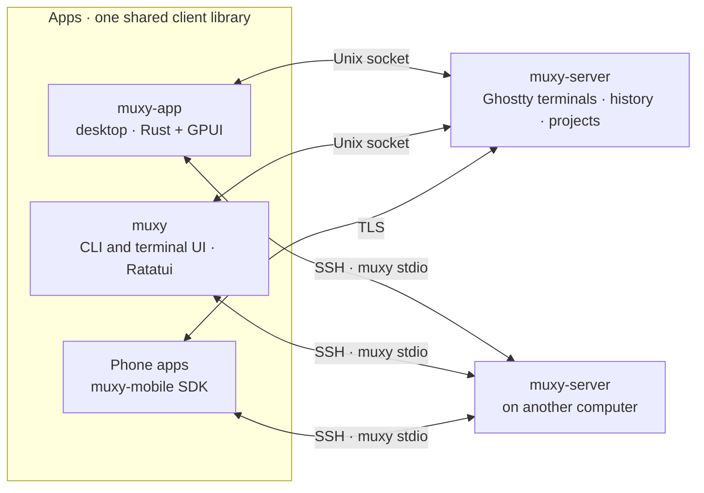

# Technical design

How the [product](../product/README.md) is built.

The big ideas:

1. **The server owns the terminals.** Each session is a Ghostty terminal on the
   server, with its history. Apps never parse terminal output. They receive rows
   of styled text and draw them.
2. **Only changes are sent.** About 60 times a second the server sends the rows
   that changed. A slow app gets one merged update, never a backlog.
3. **One client library.** The desktop app, the terminal UI, and the phone apps
   all use the same Rust client and protocol.
4. **The protocol only grows.** New fields and messages don't break older
   builds.

## Read next

1. [Architecture](./architecture.md): processes, crates, and how a keystroke
   travels.
2. [Protocol](./protocol.md): how apps and the server talk, and the
   compatibility rules.
3. [Mobile](./mobile.md): how phones pair and connect.
4. [Decisions](./decisions.md): the key choices and why they were made.
5. [Constraints](./constraints.md): supported platforms and hard-won lessons.
