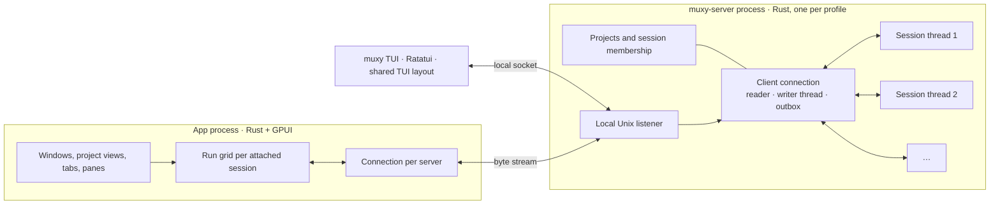
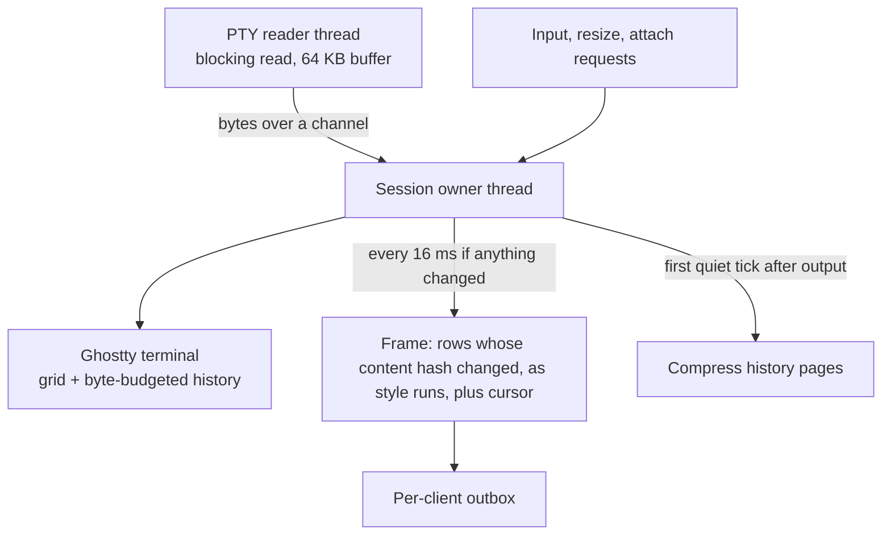
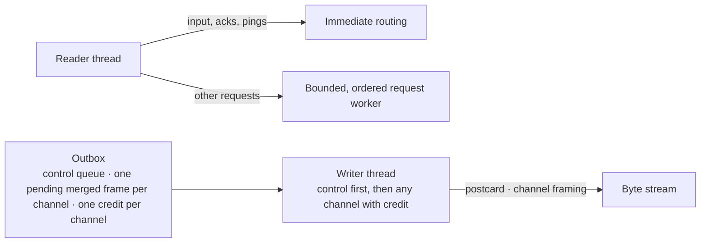
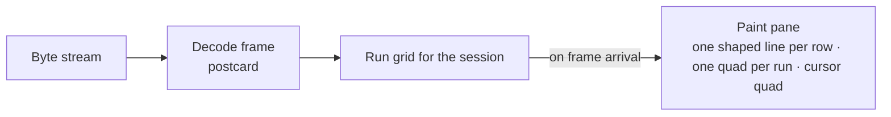

# Architecture

This document turns the [decisions](./decisions.md) into components and
boundaries. It stays above code: names are roles, not types.

## Processes

- The app never parses terminal output. It holds, per attached session, the
  visible rows as style runs plus whatever history window it has fetched.
- The server owns the durable project catalog, shared metadata, Home, and
  explicit session membership. Clients own tabs, panes, order, and workspaces.
- The desktop bundles separate `muxy` and `muxy-server` executables, also
  distributed together for standalone use. Both clients use the shared client
  library and protocol, connecting to the local server or starting it under
  the shared startup lock. Neither client links the server implementation.
- Both clients connect locally. Remote transport is outside this phase.

The server package contains its library and executable. The protocol package
owns shared screen types, wire codecs, and local transport. PTY adapters live
with the terminal backend; client settings live with the headless app model.

## Session thread

- One thread owns the terminal for the whole session lifetime. The Ghostty
  terminal is not sendable, so nothing else touches it; all requests arrive
  over the owner's channel.
- The PTY reader is a separate blocking thread because the kernel delivers
  small reads for chatty producers and the read syscall is the dominant
  cost. It does nothing but read and forward.
- The tick collects rows whose content hash changed since last sent to each
  client. Nothing is emitted when nothing changed.
- History compression runs on the first tick with no new output after a
  burst. One full pass costs single-digit milliseconds per session.
- Retention is a byte budget on Ghostty's compressed pages. Saved history keeps
  that same retained window, not a second cutoff on decoded row sizes.
- The owner captures screen and history checkpoints for a background writer.
  The writer atomically replaces each saved record; newer pending checkpoints
  replace older ones. Final output is saved before normal exit is announced.
  Indexed saved records allow reading a screen or history page without decoding
  the entire history; search reads a bounded window of rows.

## Client connection

- The connection reader never waits for storage, process creation, or owner
  replies. Bounded background work handles these requests; lifecycle work stays
  ordered. Registry locks cover bookkeeping, not blocking operations.
- Frames replace or merge into a single pending frame per attachment channel.
  The frame is sent when the client's acknowledgement for the previous frame
  on that channel has arrived.
- Control messages, including pongs, attach replies, and history pages,
  never wait behind screen data.
- Attach sends the visible screen and a recent history window as runs.
  Older history is served in pages on request.
- Any number of clients may attach to a session; each has its own outbox
  and credits, so a slow client never affects a fast one.
- Merging, credits, and control-first writing are implemented. Streaming wire
  compression remains deferred; see the [protocol](./protocol.md).

## App rendering

The app composes its views from muxy-ui, a reusable GPUI component library.
The library owns visual primitives and interaction behavior; app state and
server connections remain in the app. Shortcut identifiers, defaults, aliases,
and contexts share one headless catalog. Every module registers its handlers
through the same UI registration interface, resolved from the app keymap.
Widgets do not maintain a separate set of bindings.

The app dispatches blocking client requests on a bounded, ordered worker lane,
separate from input and frame acknowledgements. Events for established channels
remain immediate; bounded buffering keeps new-channel events and disconnects
behind their lifecycle completions. A flush waits for outstanding work.

- The app redraws a pane only when a frame arrives or the viewport changes.
- Terminal render state exists only for visible panes; the server holds
  everything else, and a pane that becomes visible attaches or re-fetches.
  Cached client content is displayed first, including while disconnected.
  Server reads refresh it lazily; the server owns durable retained history.
- A future full-emulator surface would convert runs locally without changing
  the server or protocol; see [D9](./decisions.md#d9-the-app-renders-the-run-grid-directly-in-gpui-and-redraws-on-demand).

Webview descriptors and close/result state belong to muxy-app-core. muxy-ui owns
the native WebKit adapter, scoped asset loading, and native view composition.
muxy-app retains and coordinates surfaces, focus, presentation, and the page
bridge. Hidden pages remain alive; they have no terminal session or server state.
The bridge exposes surface operations only until extension authorization exists.

## Transport adapters

Both clients and the server resolve the same profile and configured Unix
socket. Remote, stdio, and network transports are deferred. Running `muxy`
after an independent SSH login uses that machine's local server.

## Lifecycle notes

The server imports legacy project identities and session references once,
retaining the original desktop state for recovery. Clients save their migrated
views separately. Retried mutations and session creation are idempotent;
disconnected desktop edits keep their existing behavior through durable intents.
Project deletion prevents new sessions before ending and discarding owned
content, and resumes after interruption without touching project directories.

- Compatible app updates keep the server running. Installation preserves the
  old bundle until its server instance exits and bundled runtime users release
  their leases. A running TUI does not block app installation. Cleanup shares installation locks,
  verifies the current instance, and retains uncommitted recovery bundles. The app coordinates idle server
  replacement with startup and installation locks, then reconnects. Pending
  update schedules survive app restarts; no background updater launches the app.
- Saved records contain the screen, bounded history, and known exit reason.
  The app reads them through the protocol; the
  [server model](../product/server-model.md) defines retention and close behavior.
- Clients register all open-pane references separately from output subscriptions.
  The server decides final-reference closes atomically and preserves results
  across retries. A disconnect drops the client's outbox and references without
  ending its sessions.
- Resize is a request to the session owner; the terminal reflows and the
  next tick emits the full visible screen.

## AI activity

Session owners classify supported agent processes against bounded live-screen,
title, and terminal-progress evidence. Bundled detection rules are compiled once;
clients never inspect terminal output for agent state.

The server coalesces activity invalidations independently of screen attachments.
Clients fetch current status and bounded history and acknowledge event IDs. A
background writer persists history without blocking terminal owners. One connected
desktop client claims new events for native delivery; other clients receive the
same status and read state.
