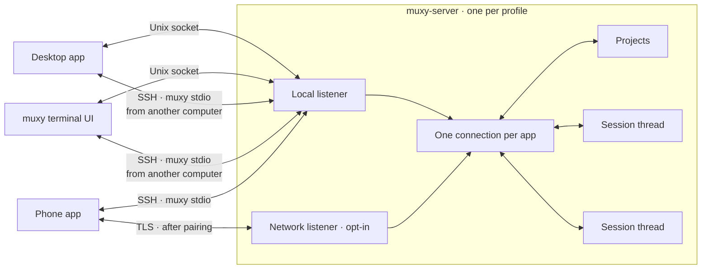
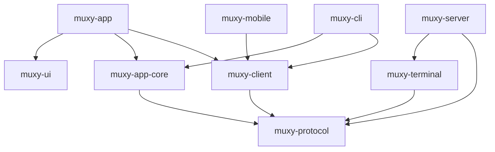
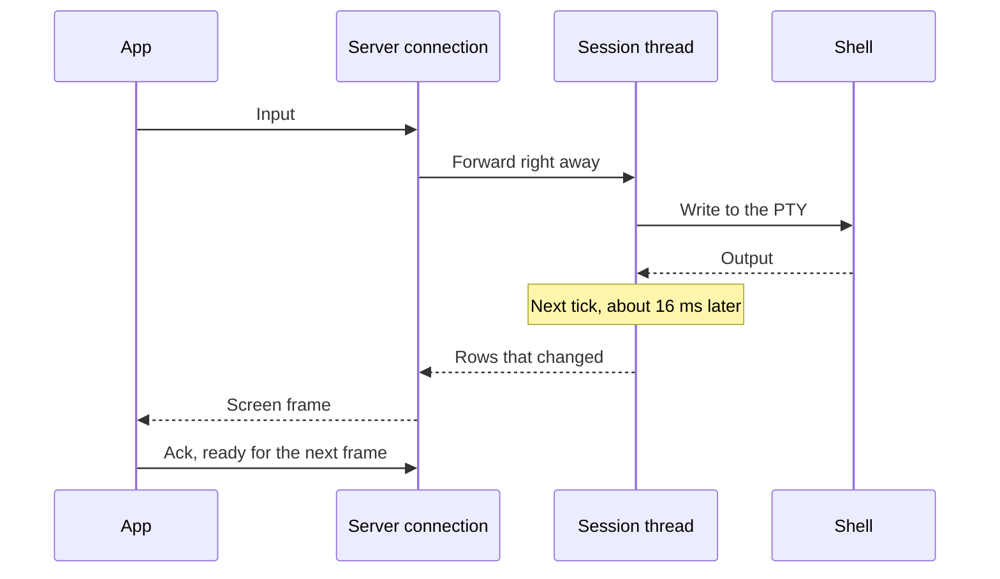
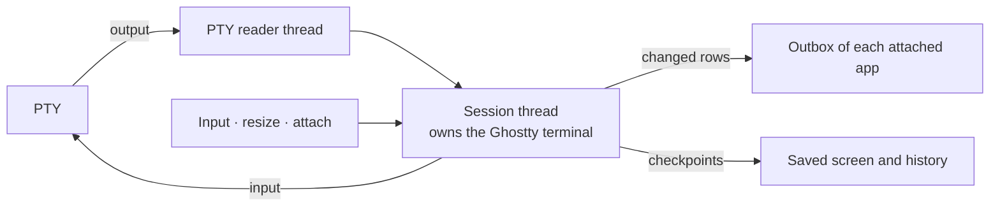
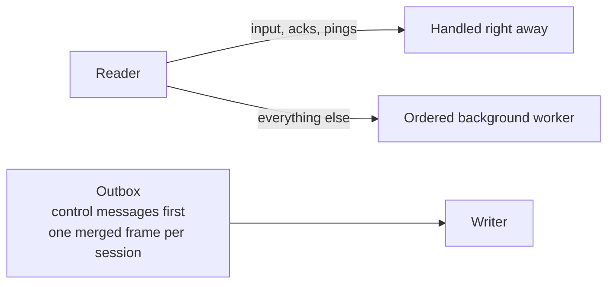

# Architecture

The processes, the crates, and how data moves between them.

## Processes

```mermaid
flowchart LR
    DESKTOP["Desktop app"] <-->|"Unix socket"| LOCAL
    TUI["muxy terminal UI"] <-->|"Unix socket"| LOCAL
    DESKTOP <-->|"SSH · muxy stdio<br/>from another computer"| LOCAL
    TUI <-->|"SSH · muxy stdio<br/>from another computer"| LOCAL
    PHONE["Phone app"] <-->|"TLS · after pairing"| NETWORK
    PHONE <-->|"SSH · muxy stdio"| LOCAL
    subgraph SERVER["muxy-server · one per profile"]
        LOCAL["Local listener"]
        NETWORK["Network listener · opt-in"]
        CONNECTION["One connection per app"]
        CATALOG["Projects"]
        S1["Session thread"]
        S2["Session thread"]
        LOCAL --> CONNECTION
        NETWORK --> CONNECTION
        CONNECTION <--> CATALOG
        CONNECTION <--> S1
        CONNECTION <--> S2
    end
```

- The desktop app ships the `muxy` and `muxy-server` executables, which are
  also released on their own. Either app starts the server if it isn't running.
- The server keeps projects and which sessions belong to them. Apps keep tabs,
  panes, order, and workspaces.
- The desktop app keeps one connection per server: this computer's, and one per
  remote device.
- Apps never include server code. They only speak the [protocol](./protocol.md).

## Crates

```mermaid
flowchart TB
    APP["muxy-app"] --> UI["muxy-ui"]
    APP --> APPCORE["muxy-app-core"]
    APP --> CLIENT["muxy-client"]
    CLI["muxy-cli"] --> APPCORE
    CLI --> CLIENT
    MOBILE["muxy-mobile"] --> CLIENT
    CLIENT --> PROTOCOL["muxy-protocol"]
    APPCORE --> PROTOCOL
    SERVER["muxy-server"] --> TERMINAL["muxy-terminal"]
    SERVER --> PROTOCOL
    TERMINAL --> PROTOCOL
```

| Crate | Role |
| --- | --- |
| `muxy-app` | The desktop app. |
| `muxy-ui` | Reusable GPUI components and native web views. No app state. |
| `muxy-app-core` | The app model without UI, shared by desktop and terminal UI: layouts, workspaces, settings, extensions. |
| `muxy-cli` | The `muxy` command: CLI and terminal UI. |
| `muxy-client` | Connects to a server, starting a local one if needed. |
| `muxy-mobile` | The client library for phones, with Swift and Kotlin bindings. |
| `muxy-protocol` | Messages, encoding, screen types, and transports. |
| `muxy-server` | The server: projects, sessions, history, Git, files, and mobile access. |
| `muxy-terminal` | Wraps the Ghostty terminal and the PTY. |
| `muxy-core` | Shared basics, such as folders, locks, the shortcut catalog, and the app language. |

## Typing a key

```mermaid
sequenceDiagram
    participant App
    participant Connection as Server connection
    participant Session as Session thread
    participant Shell
    App->>Connection: Input
    Connection->>Session: Forward right away
    Session->>Shell: Write to the PTY
    Shell-->>Session: Output
    Note over Session: Next tick, about 16 ms later
    Session-->>Connection: Rows that changed
    Connection-->>App: Screen frame
    App->>Connection: Ack, ready for the next frame
```

## Inside a session

```mermaid
flowchart LR
    PTY["PTY"] -->|"output"| READER["PTY reader thread"]
    READER --> OWNER["Session thread<br/>owns the Ghostty terminal"]
    REQUESTS["Input · resize · attach"] --> OWNER
    OWNER -->|"input"| PTY
    OWNER -->|"changed rows"| OUTBOX["Outbox of each attached app"]
    OWNER -->|"checkpoints"| DISK["Saved screen and history"]
```

- One thread owns each terminal for its whole life. The Ghostty terminal isn't
  thread-safe, so everything else sends that thread messages.
- A separate thread only reads the PTY and forwards bytes. Chatty programs
  produce many tiny reads.
- Every tick, if anything changed, the session sends the changed rows and the
  cursor. If nothing changed, nothing is sent.
- When output goes quiet after a burst, history is compressed.
- A background writer saves the screen and history, so they survive the program
  and the server.

## Inside a connection

```mermaid
flowchart LR
    READ["Reader"] -->|"input, acks, pings"| FAST["Handled right away"]
    READ -->|"everything else"| WORKER["Ordered background worker"]
    OUTBOX["Outbox<br/>control messages first<br/>one merged frame per session"] --> WRITE["Writer"]
```

- Each app has its own connection and outbox, so a slow app never slows a fast
  one.
- The reader never waits on disk or on starting processes.
- Screen updates merge: a newer frame folds into the one not yet sent, which
  goes out once the app acknowledges the previous one.
- Replies and other control messages never wait behind screen data.

## Drawing in the app

- For each visible terminal, the app keeps the screen rows as styled runs, plus
  any history it has fetched.
- It repaints a pane only when a frame arrives or the view changes: one text
  line per row and one rectangle per color run.
- Hidden panes hold nothing. They attach again when shown, displaying cached
  content first, even while offline.
- The UI is built from `muxy-ui` components. Every app shortcut comes from one
  catalog, resolved through the keymap. Terminal key bindings come from
  `ghostty.conf`, and the Quick Terminal's global shortcut is its own setting.

## Extensions and web views

- Web views are native WebKit views and stay alive while hidden. They have no
  terminal or server state.
- The app loads extensions, enforces their permissions, and asks before
  sensitive actions. Their scripts run in JavaScriptCore on their own threads.
- File, Git, and process work goes through the server. Extension web requests
  run in the app and can't reach the local machine or private networks.
- Marketplace packages are verified before they are installed.
- Language packs are resource-only bundles. The app reads their catalogs, checks
  that each translation keeps its key's placeholders, and runs nothing from them.

## AI activity

- Each session thread checks the running program, the title, and the screen
  against built-in rules to find agents and their state.
- Apps get agent status from the server. They never read terminal output
  themselves.
- One desktop app delivers system notifications, so alerts are never doubled.

## Updates

- If the new app speaks the running server's protocol version, the server keeps
  running and is replaced once no terminals are left.
- Otherwise the update waits for every terminal to end, or ends them after the
  user confirms.
- The old app bundle is kept until its server exits.
