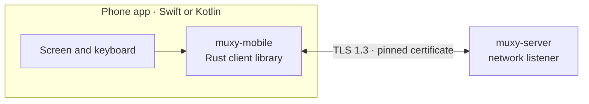
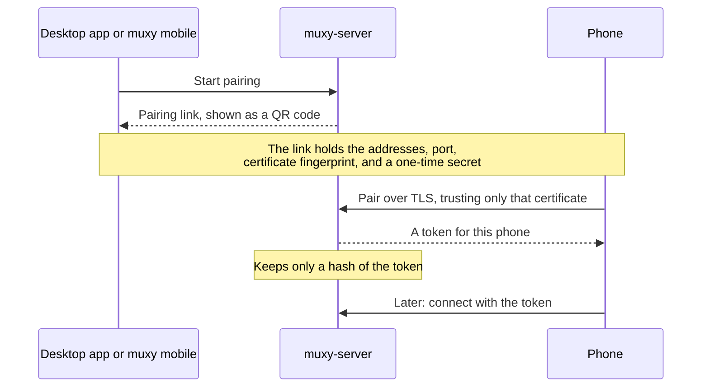

# Mobile

Phones connect straight to `muxy-server` on the user's computer. There is no
cloud service: the phone must be on the same network or reach the computer
through a VPN such as Tailscale.

## Pairing

## Security

- Mobile access is off until the user turns it on.
- The phone trusts only the certificate named in the pairing code, so another
  machine can't pretend to be the computer.
- Each phone has its own token and can be revoked at any time. Revoking closes
  its connection at once.
- A connection that hasn't signed in gets nothing else from the server.
- Phones can't manage mobile access, change server settings, stop the server,
  or run extension commands.

## The SDK

- `muxy-mobile` wraps the shared Rust client with UniFFI, which generates Swift
  and Kotlin bindings. Phones use the same protocol and flow control as the
  desktop app.
- The SDK keeps each attached screen up to date. The app draws it and sends
  input.
- Each release publishes the SDK for iOS and Android next to the desktop app.
  `scripts/build-mobile-sdk.sh` builds it locally.
- A phone works with any server that shares its protocol version, so phone
  releases only need to follow breaking protocol changes.

The full integration guide, with the API, setup, and error handling, is in
[`crates/muxy-mobile/README.md`](../../crates/muxy-mobile/README.md).
