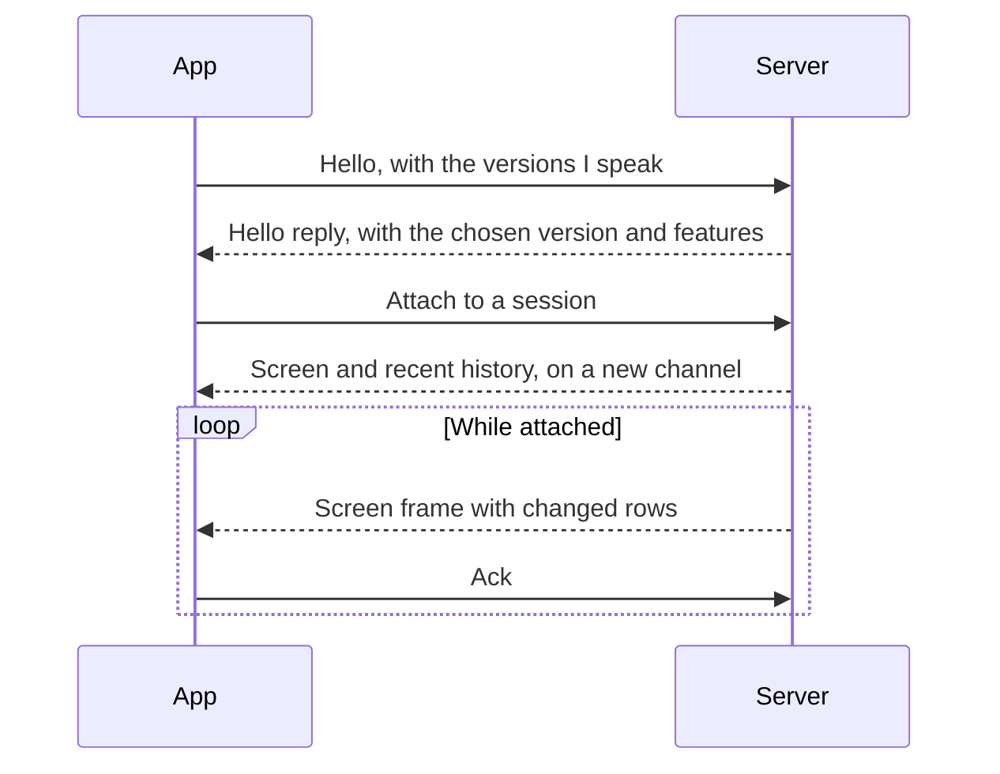
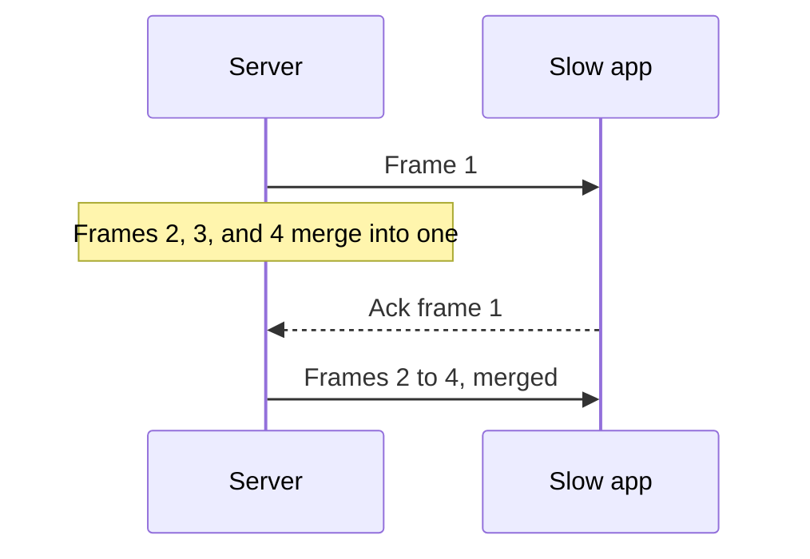

# Protocol

How apps and the server talk. The exact messages live in `crates/muxy-protocol`.

## Connection

- The connection is a reliable byte stream: a Unix socket on the same computer,
  SSH to `muxy stdio` on another computer, or TLS for
  [paired phones](./mobile.md).
- Traffic is split into channels. Channel 0 carries control messages, and each
  attached session gets its own channel for screen updates and input.
- Every frame starts with a small header: length, protocol version, channel, and
  message kind. Messages are CBOR with numbered fields. Screen rows use postcard.

## Requests and replies

- Every request carries an ID and gets exactly one reply, in any order.
- A bad request, such as an unknown session or an invalid path, gets an error
  reply and the connection stays open.
- A request the server doesn't know gets an "unsupported" reply. That is how an
  older server answers a newer app.
- Malformed traffic closes the connection.
- For shared state, such as projects, sessions, and AI activity, the server
  sends a short "changed" notice and apps read the new state again.

## Screen updates

- A row is a list of style runs: text, its style, and its cell widths. Apps need
  no Unicode width tables.
- Frames carry only the visible rows that changed. A resize sends the whole
  screen.
- History is never pushed. Apps page through it and search it on request.

## Flow control

Each attached session has at most one frame in flight to each app. While the
app is busy, newer output merges into a single waiting frame.

Memory stays small, and a slow app jumps straight to the latest screen. Control
messages are always written first. Wire compression is planned but not built
yet.

## Versions

Two builds can talk when they share a protocol version, currently V2. Only a
breaking change bumps the version. Fields and enum values have permanent numbers
that are never reused, so a build skips fields it doesn't know and shows unknown
values neutrally.

| Change | Bumps the version? |
| --- | --- |
| Add an optional field or one with a default | No |
| Add an enum value | No |
| Add a request | No. Older servers reply "unsupported" |
| Add something the server must act on | No. Add it as a new request or feature, since older servers ignore unknown fields |
| Remove something | No. Stop using it and keep its number reserved |
| Change a type or meaning, make a field required, or change screen rows or the header | Yes |

Encoded samples of each version are kept in
`crates/muxy-protocol/tests/fixtures/v<N>` and are only ever added to. CI
checks that the current build reads every sample and that the last release
reads the current ones. Saved user data must never be lost when a format
changes.
